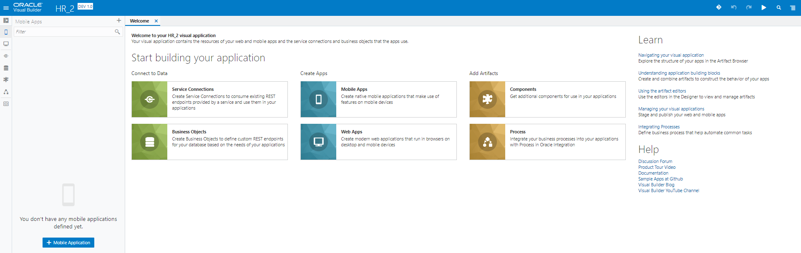

[Oracle VBCS はじめての Web アプリケーション開発](../../README.md) >
[パート1: Web アプリケーションの作成](README.md)

## ビジュアル・アプリケーションの作成

Oracle Visual Builder Cloud Serviceでは最初に、ビジュアル・アプリケーションを作成します。
ビジュアル・アプリケーションは、Webアプリケーションやモバイル・アプリケーションを会はつるために使用するリソースの集まりです。
アプリケーションのソース・ファイルや、メタデータが記述されたJSONファイルを含んでいます。

##### 【ステップ 1】

Web ブラウザを使用して Oracle Visual Builder Cloud Service（以下 VBCS）にログインします。

##### 【ステップ 2】

VBCS の **「Visual Applications」** ページが表示されたら、**「New Application」** ボタンをクリックします。

##### 【ステップ 3】

**「Create Application」** ダイアログ・ボックスが表示されます。
[表 1-1-1](#tab1-1-1)のように設定します。

###### 表 1-1-1: 「Create Application」ダイアログ・ボックスで設定する値 {#tab1-1-1}

|設定項目  |設定する値 |説明     |
|--------|--------|--------|
|**「Application name」**|`HR Application`|アプリケーションにつける名前|
|**「Id」**|`hr_application_<xx>`|アプリケーションのID。アプリケーションの URL にも用いられるので、VBCSのインスタンス内で一意である必要があります。 *&lt;xx&gt;* の部分はご自身のイニシャルなどと置き換えてください。|
|**「Description」**|`Tutorial Application`|アプリケーションの簡単な説明
|**「Application template」**| `Empty Application`(デフォルト) | アプリケーションのテンプレート

値を設定したら、**「Create Application」** ダイアログ・ボックスの **「Finish」** ボタンをクリックします。

ビジュアル・アプリケーションが作成されると、VBCSのアプリケーション・デザイナでビジュアル・アプリケーションがオープンします。
アプリケーション・デザイナにはアーティファクト・ブラウザとWelcomeスクリーンが表示されます。
Welcomeスクリーンには、VBCSでアプリケーションを作成するためのタスクのガイドが表示されます。

アプリケーション・デザイナの左側の領域はアーティファクト・ブラウザと呼ばれる領域で、アプリケーションを構成する各種ソース・ファイル（HTML/CSS/JavaScriptなど）や、データ・アクセスや画面フローの設定などアプリケーションを実行する際に必要となるメタデータ（JSONファイル）が表示され、アクセスできます。

アーティファクト・デザイナには、次のタブ・ページがあります。

* Service Connections
* Business Objects
* Mobile Applications
* Web Applications
* Processes Cloud
* Components

画面上部のアプリケーションの名前（Application nameとして指定したテキスト）の右隣に表示される **「dev」** と **「1.0」** はそれぞれ、アプリケーションのステータス（development: 開発中を表す）とバージョンを表しています。
