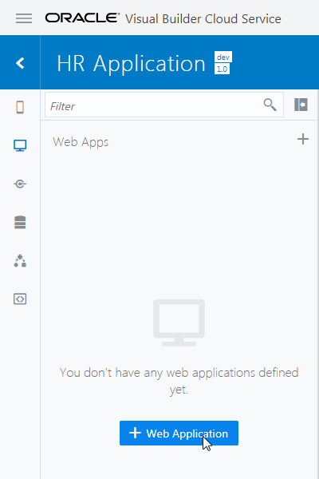
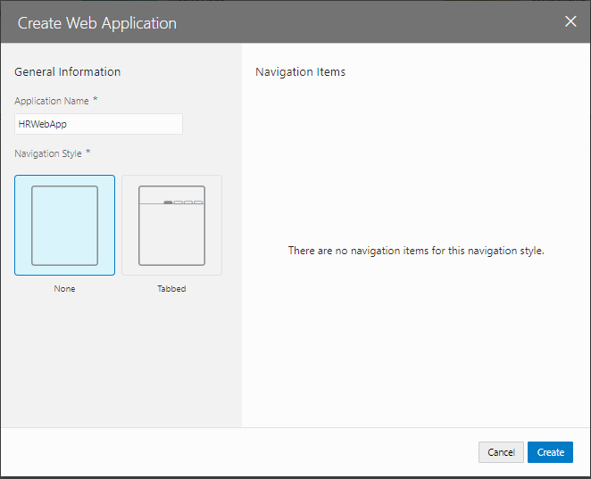
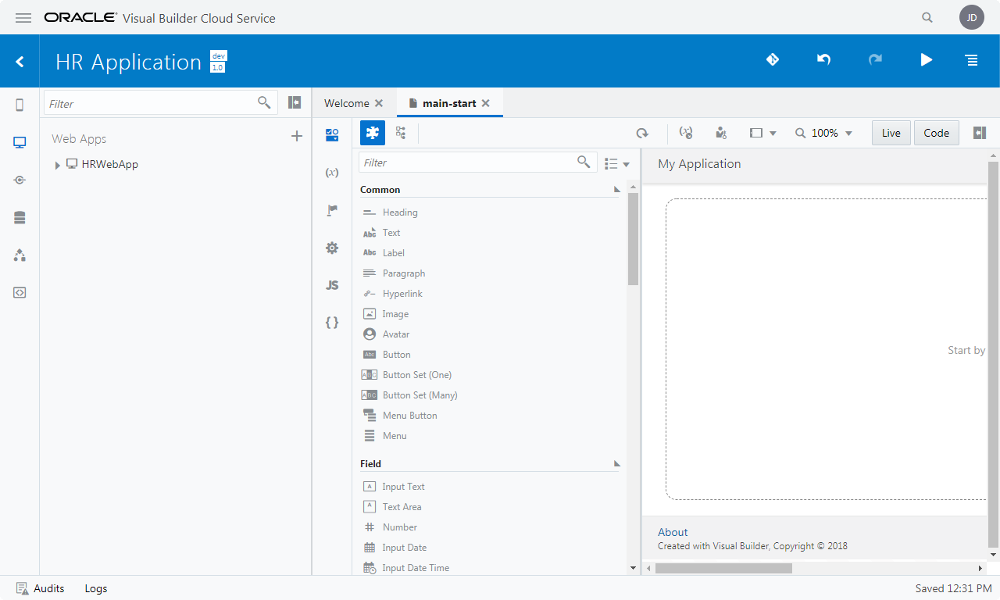
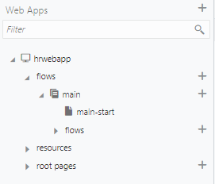

[Oracle VBCS はじめての Web アプリケーション開発](../../README.md) >
[パート1: Web アプリケーションの作成](README.md)

## Web アプリケーションの作成

VBCS のビジュアル・アプリケーションは、1つ以上のWebアプリケーションまたはモバイル・アプリケーションを持ちます。
このチュートリアルでは、Webアプリケーションを作成します。

##### 【ステップ 1】

アーティファクト・ブラウザの **「Web Applications」** タブ

をクリックします。
**「+ Web Application」** ボタン（またはアーティファクト・ブラウザの右上にある **「＋」** アイコン）をクリックします。

##### 【ステップ 2】

**「Create Web Application」** ダイアログ・ボックスが表示されたら、**「Application Name」** フィールドに `HRWebApp` と入力し、**Navigation Style**に`None`を選択し、 **「Create」** ボタンをクリックします。

##### 【ステップ 3】

HRWebApp のアーティファクトが生成されます。
ページ・デザイナで表示されている **「main-start」** が、アプリケーションの起動時に最初に表示される画面です。

##### 【ステップ 4】

アーティファクト・ブラウザで **「HRWebApp」** ノードを展開するとWebアプリケーションの構造が表示されます。
**「flows」** ノードと **「main」** ノードを展開すると **「main-start」** ページが表示されます。

次に[パート2:ビジネス・オブジェクトの作成](../part2/README.md)に進みます。
