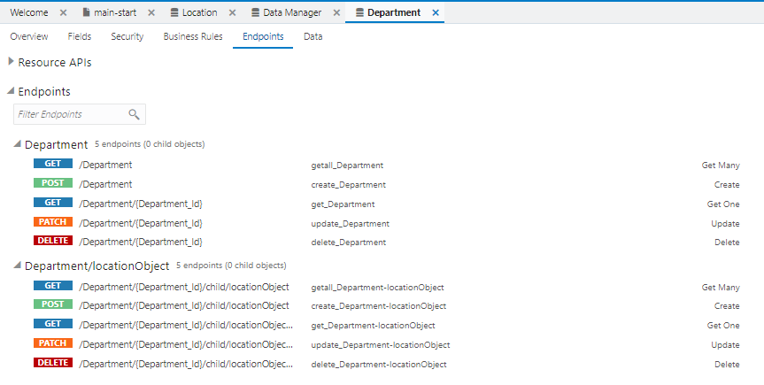

[Oracle VBCS はじめての Web アプリケーション開発](../../README.md) >
[パート2: ビジネス・オブジェクトの作成](README.md)

## ビジネス・オブジェクト Department の作成

ここでは、部門を表すビジネス・オブジェクト Department を作成します。

ビジネス・オブジェクト Department を作成するためには、事前にビジネス・オブジェクト Location を作成してある必要があります。
ビジネス・オブジェクト Location の作成手順は[『ビジネス・オブジェクト Location の作成』](create_bo_location.md)で説明しています。

### ビジネス・オブジェクトの作成

##### 【ステップ 1】

アーティファクト・ブラウザの **「Business Objects」** タブ

をクリックします。

##### 【ステップ 2】

アーティファクト・ブラウザの右上部にある **「+」** （Create Business Object）アイコンをクリックします。

##### 【ステップ 3】

**「New Business Object」** ポップアップ・ボックスが表示されたら、[表 2-2-1](#tab2-2-1) のように設定して、

（Create）ボタンをクリックします。

###### 表 2-2-1: ビジネス・オブジェクト Department の設定 {#tab2-2-1}

|設定項目      |設定する値     |
|------------|------------|
|**「Label」**|`Department`|
|**「Id」**   |`Department`|

### フィールド name の作成

##### 【ステップ 1】

ビジネス・オブジェクト Department の **「Fields」** タブ・ページの **「+ New Field」** ボタンをクリックします。

##### 【ステップ 2】

ポップアップ・ボックスが表示されたら、追加するフィールドの設定を [表 2-2-2](#tab2-2-2) のように設定し、

（Create）ボタンをクリックします。

###### 表 2-2-2: 追加するフィールド Name の設定 {#tab2-2-2}

|設定項目      |設定する値|
|------------|--------|
|**「Label」**|`Name`  |
|**「Field Name」**   |`name`  |
|**「Type」** |**「String」**  を選択|

##### 【ステップ 3】

フィールド Name が追加されると画面の右端のプロパティ・エディタに Name のプロパティが表示されます。
**「Constraints」** の下にある **「Required」** をチェックします。

##### 【ステップ 4】

プロパティ・エディタで **「Required」** をチェックすると、追加されたフィールド Name は必須データ項目に設定されます。
**「Required」** 列にチェック・マークが表示されていることを確認します。

### フィールド location の作成

##### 【ステップ 1】

ビジネス・オブジェクト Department の **「Fields」** タブ・ページの **「+ New Field」** ボタンをクリックします。

##### 【ステップ 2】

ポップアップ・ボックスが表示されたら、追加するフィールドの設定を [表 2-2-3](#tab2-2-3) のように設定し、

（Create）ボタンをクリックします。

###### 表 2-2-3: 追加するフィールド Location の設定 {#tab2-2-3}

|設定項目      |設定する値  |説明|
|------------|----------|---|
|**「Label」**|`Location`|   |
|**「Field Name」**   |`location`|   |
|**「Type」** |**「Reference」** 　を選択| |
|**「Reference Business Object」**|**「Location」** を選択|作成するフィールドがデータを参照するビジネス・オブジェクトを選択|
|**「Default Display Field」**    |**「Name」** を選択|データを編集する際のリストの表示に使用される、参照先のビジネス・オブジェクト（今回は Location）のフィールドを選択|

##### 【ステップ 3】

ビジネス・オブジェクト Department の **「Endpoints」** タブ・ページを開きます。
ビジネス・オブジェクト Department のデータを操作するためのエンドポイントが一覧できます。

ビジネス・オブジェクト Department は Location を参照しているので、 `/Department/{Department_Id}/child/locationObject` というエンドポイントで Department が参照している Location のデータにアクセスできます。  

次に[ビジネス・オブジェクト Employeeの作成](create_bo_employee.md)に進みます。
