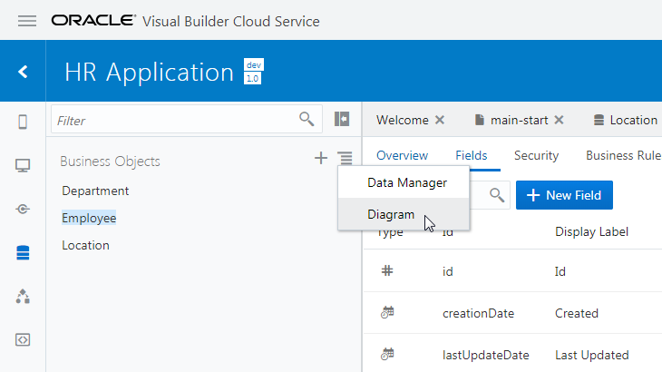

[Oracle VBCS はじめての Web アプリケーション開発](../../README.md) >
[パート2: ビジネス・オブジェクトの作成](README.md)

## ビジネス・オブジェクト Employee の作成

ここでは、従業員を表すビジネス・オブジェクト Employee を作成します。

ビジネス・オブジェクト Employee を作成するためには、事前にビジネス・オブジェクト Location と Department を作成してある必要があります。
ビジネス・オブジェクト Location の作成手順は[『ビジネス・オブジェクト Location の作成』](create_bo_location.md)で、Department の作成手順は[『ビジネス・オブジェクト Department の作成』](create_bo_department.md) でそれぞれ説明しています。

### ビジネス・オブジェクトの作成

##### 【ステップ 1】

アーティファクト・ブラウザの **「Business Objects」** タブ

をクリックします。

##### 【ステップ 2】

アーティファクト・ブラウザの右上部にある **「+」** （Create Business Object）アイコンをクリックします。

##### 【ステップ 3】

**「New Business Object」** ポップアップ・ボックスが表示されたら、[表 2-3-1](#tab2-3-1) のように設定して、

（Create）ボタンをクリックします。

###### 表 2-3-1: ビジネス・オブジェクト Employee の設定 {#tab2-3-1}

|設定項目      |設定する値   |
|------------|----------|
|**「Label」**|`Employee`|
|**「Id」**   |`Employee`|

### フィールド name の作成

##### 【ステップ 1】

ビジネス・オブジェクト Employee の **「Fields」** タブ・ページの **「+ New Field」** ボタンをクリックします。

##### 【ステップ 2】

ポップアップ・ボックスが表示されたら、追加するフィールドの設定を [表 2-3-2](#tab2-3-2) のように設定し、 **「Create」** ボタンをクリックします。

###### 表 2-3-2: 追加するフィールド Name の設定 {#tab2-3-2}

|設定項目      |設定する値|
|------------|--------|
|**「Label」**|`Name`  |
|**「Id」**   |`name`  |
|**「Type」** |**「String」**  を選択|

##### 【ステップ 3】

フィールド Name が追加されると画面の右端のプロパティ・エディタに Name のプロパティが表示されます。
**「Constraints」** の下にある **「Required」** をチェックします。

##### 【ステップ 4】

プロパティ・エディタで **「Required」** をチェックすると、追加されたフィールド Name は必須データ項目に設定されます。
**「Required」** 列にチェック・マークが表示されていることを確認します。

### フィールド department の作成

##### 【ステップ 1】

ビジネス・オブジェクト Employee の **「Fields」** タブ・ページの **「+ New Field」** ボタンをクリックします。

##### 【ステップ 2】

ポップアップ・ボックスが表示されたら、追加するフィールドの設定を [表 2-3-3](#tab2-3-3) のように設定し、

（Create）ボタンをクリックします。

###### 表 2-3-3: 追加するフィールド department の設定 {#tab2-3-3}

|設定項目      |設定する値  |
|------------|----------|
|**「Label」**|`Department`|
|**「Id」**   |`department`|
|**「Type」** |**「Reference」** 　を選択|
|**「Reference Business Object」**|**「Department」** を選択|
|**「Default Display Field」**    |**「Name」** を選択|

### フィールド hireDate の作成

##### 【ステップ 1】

ビジネス・オブジェクト Employee の **「Fields」** タブ・ページの **「+ New Field」** ボタンをクリックします。

##### 【ステップ 2】

ポップアップ・ボックスが表示されたら、追加するフィールドの設定を [表 2-3-4](#tab2-3-4) のように設定し、

（Create）ボタンをクリックします。

###### 表 2-3-4: 追加するフィールド hireDate の設定 {#tab2-3-4}

|設定項目      |設定する値|
|------------|--------|
|**「Label」**|`Hire Date`|
|**「Id」**   |`hireDate` |
|**「Type」** |**「Date」**  を選択|

### フィールド email の作成

##### 【ステップ 1】

ビジネス・オブジェクト Employee の **「Fields」** タブ・ページの **「+ New Field」** ボタンをクリックします。

##### 【ステップ 2】

ポップアップ・ボックスが表示されたら、追加するフィールドの設定を [表 2-3-5](#tab2-3-5) のように設定し、

（Create）ボタンをクリックします。

###### 表 2-3-5: 追加するフィールド email の設定 {#tab2-3-5}

|設定項目      |設定する値|
|------------|--------|
|**「Label」**|`Email`|
|**「Id」**   |`email` |
|**「Type」** |**「Email」**  を選択|

##### 【ステップ 3】

4つのフィールドを追加したら、ビジネス・オブジェクト Employee の **「Endpoints」** タブ・ページを開きます。

EmployeeはDepartmentを参照し、DepartmentはLocation を参照しているので、それぞれのノードを展開するとこのパートで作成した3つのビジネス・オブジェクトすべてにアクセスできることがわかります。

### ビジネス・オブジェクトのダイアグラムの確認

##### 【ステップ 1】

アーティファクト・ブラウザの右上部に表示されている

（**「メニュー」**）アイコンをクリックします。
メニューから、 **「Diagram」** を選択します。

##### 【ステップ 2】

ビジュアル・アプリケーション内に定義されているすべてのビジネス・オブジェクトの関連を表すダイアグラムが表示されます。

  

次に[パート3:ビジネス・オブジェクトを参照・作成するページの作成](../part3/README.md)に進みます。
