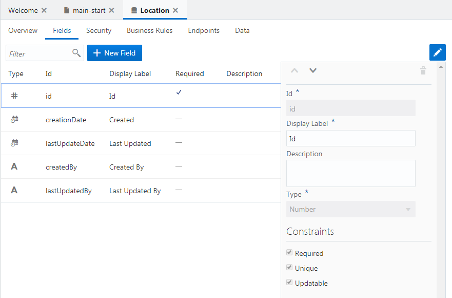
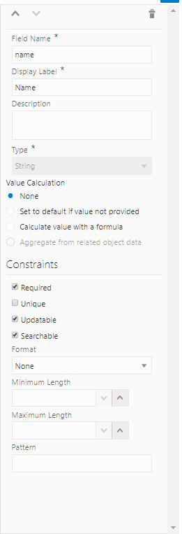
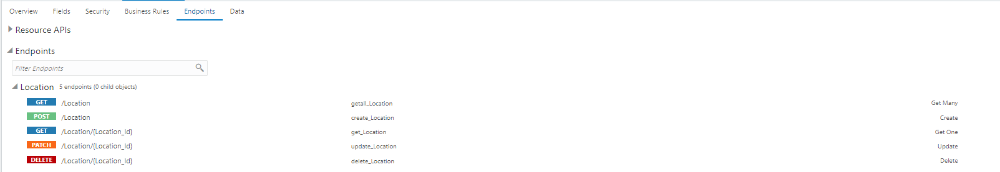
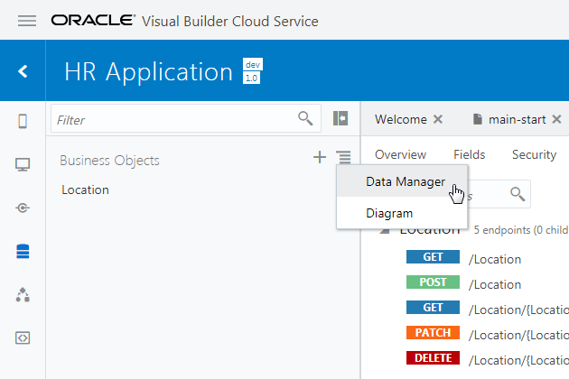
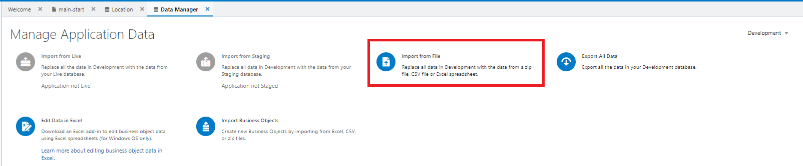
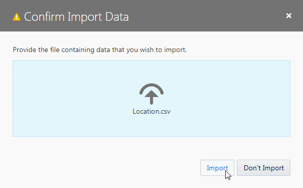

[Oracle VBCS: はじめての Web アプリケーション開発](../../README.md) >
[パート2: ビジネス・オブジェクトの作成](README.md)

## ビジネス・オブジェクト Location の作成

ここでは、オフィスの所在地を表すビジネス・オブジェクト Location を作成します。
次に、作成したビジネス・オブジェクトにフィールドを追加します。
最後に、CSV ファイルからデータをインポートします。

### ビジネス・オブジェクトの作成

##### 【ステップ 1】

アーティファクト・ブラウザの **「Business Objects」** タブ

をクリックします。

##### 【ステップ 2】

アーティファクト・ブラウザにある **「+ Business Object」** ボタン、または右上部にある **「＋」**（Create Business Object） アイコンをクリックします。

##### 【ステップ 3】

**「New Business Object」** ポップアップ・ボックスが表示されたら、 [表 2-1-1](#tab2-1-1) のように設定して、

（Create）ボタンをクリックします。

###### 表 2-1-1: ビジネス・オブジェクト Location の設定 {#tab2-1-1}

|設定項目      |設定する値  |説明|
|------------|----------|---|
|**「Label」**|`Location`|作成するビジネス・オブジェクトの表示名|
|**「Id」**   |`Location`|作成するビジネス・オブジェクトを識別するためのID。Labelと同じ値が自動的に設定されます。|

##### 【ステップ 4】

ビジネス・オブジェクトが作成されたら、 **「Fields」** タブをクリックます。
5つのフィールドが定義されています。

* **Id**: レコードを一意に識別する ID
* **creationDate**: レコードの作成日時
* **lastUpdateDate**: レコードの最終更新日時
* **createdBy**: レコードを作成したユーザー
* **lastUpdatedBy**: レコードを更新したユーザー

### フィールド name の作成

##### 【ステップ 1】

ビジネス・オブジェクト Location の **「Fields」** タブ・ページの **「+ New Field」** ボタンをクリックします。

##### 【ステップ 2】

ポップアップ・ボックスが表示されたら、追加するフィールドの設定を『表 2-1-2』のように設定し、

（Create）ボタンをクリックします。

###### 表 2-1-2: 追加するフィールド Name の設定

|設定項目      |設定する値|説明|
|------------|--------|---|
|**「Label」**|`Name`  |追加するフィールドのラベル|
|**「Id」**   |`name`  |追加するフィールドを識別するためのID。Labelを入力すると自動的に設定されます。|
|**「Type」** |**「String」** |追加するフィールドのデータ型|

##### 【ステップ 3】

フィールド name が追加されると画面の右端のプロパティ・エディタに name のプロパティが表示されます。
**「Constraints」** の下にある **「Required」** をチェックします。

##### 【ステップ 4】

プロパティ・エディタで **「Required」** をチェックすると、フィールド name は必須データ項目に設定されます。
レコードの作成や編集フォームで、値が入力されているかどうか自動的にチェックされるようになります。
**「Required」** 列にチェック・マークが表示されていることを確認します。

##### 【ステップ 5】

**「Endpoints」** タブ・ページを開くと、このビジネス・オブジェクトのデータの参照、作成、更新、削除のための REST API のエンドポイントが一覧できます。

それぞれの行は左から、HTTPメソッド、エンドポイントのURL、エンドポイントを識別する名前、エンドポイントの説明が記述されています。

### データのインポート

##### 【ステップ 1】

[Location.csv](https://raw.githubusercontent.com/oracle-japan/vbcs-gettingstarted-webapp/master/contents/part2/Location.csv) をダウンロードします。
Location.csv には、4件の所在地データが含まれています。

##### 【ステップ 2】

アーティファクト・ブラウザの右上部に表示されている

（**「メニュー」**）アイコンをクリックします。
メニューから、 **「Data Manager」** を選択します。

##### 【ステップ 3】

**「Data Manager」** タブ・ページが表示されます。
**「Import from File」** ボックスをクリックします。

##### 【ステップ 4】

**「Confirm Import Data」** ダイアログ・ボックスが表示されます。
**「Upload a file or drag it here」** と書かれたボックスをクリックするとファイルを開くウィンドウが表示されるので、ダウンロードした `Location.csv` を開き、 **「Import」** ボタンをクリックします。

##### 【ステップ 5】

**「Import from File」** ダイアログ・ボックスにインポートが成功したことを表すメッセージが表示されたら、 **「OK」** ボタンをクリックします。

##### 【ステップ 6】

アプリケーション・ナビゲーション・エリアの **「Business Objects」** タブ・ページで、 **「Location」** を選択します。
**「Data」** タブ・ページを開くと、追加されたレコードが表示されます。

次に[ビジネス・オブジェクト Departmentの作成](create_bo_department)に進みます。
