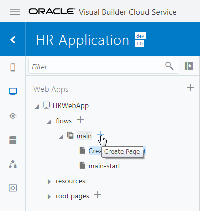
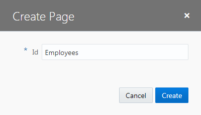

[Oracle VBCS はじめての Web アプリケーション開発](../../README.md) >
[パート3: データを参照・作成するページの作成](README.md)

## Employee のレコードの一覧を表示するページの追加

### ページの作成

##### 【ステップ 1】

アーティファクト・ブラウザの **「Web Applications」** タブ

をクリックします。
**「HRWebApp」** → **「flows」** ノードを展開し、 **「main」** ノードの右に表示される **「＋」** アイコン（Create Page）をクリックします。

##### 【ステップ 2】

**「Create Page」** ダイアログ・ボックスが表示されます。
**「Id」** フィールドに初期表示される `main-` を削除し、 `Employees` と入力します。

**「Create」** ボタンをクリックすると、Employees ページが作成され、アプリケーション・デザイナで表示されます。

##### 【ステップ 3】

コンポーネント・パレットの **「Common」** の下にある **「Heading」** コンポーネントを Employees　ページにドラッグ＆ドロップします。

##### 【ステップ 4】

Heading コンポーネントのプロパティ・インスペクタで、 **「Text」** フィールドに `従業員一覧` と入力します。

### テーブルの追加

##### 【ステップ 1】

コンポーネント・パレットを下にスクロールし、 **「Collection」** カテゴリの **「Table」** コンポーネントを、追加済みの Heading コンポーネントの下にドラッグ＆ドロップします。

##### 【ステップ 2】

追加された Table コンポーネントのプロパティ・インスペクタで

（Quick Start）タブを開き、**「Add Data」** をクリックします。

##### 【ステップ 3】

**「Add Data」** ダイアログ・ボックスが表示されます。
**「Locate Data」** ページでは、テーブルに表示するデータを取得する REST エンドポイントを選択します。
**「Business Objects」** → **「Employee」** を選択します。

##### 【ステップ 4】

**「Add Data」** ダイアログ・ボックスの **「Bind Data」** ページでは、テーブルの列を選択します。
**「item[i]」** ノードの下に表示されている **「id」**、**「name」**、**「hireDate」**、**「email」** を順番にチェックします。

**「Add Data」** ダイアログ・ボックスの右側に表示される **「Columns」** リストに、次の順番で表示されていることを確認します。

1. id
2. name
3. hireDate
4. email

表示されている順番が異なる場合は、部分をドラッグ ＆ ドロップして順番を入れ替えます。

##### 【ステップ 5】

さらに同ページの **「departmentObject」** → **「items」** ノードを展開すると、その下にある **「item[i]」** ノードが自動的に展開されます。
**「Name」** をチェックしてから **「Next」** ボタンをクリックします。

##### 【ステップ 6】

**「Add Data」** ダイアログ・ボックスの **「Define Query」** ページでは、そのまま **「Finish」** ボタンをクリックします。

##### 【ステップ 7】

追加された Table コンポーネントのプロパティ・インスペクタを開き、 **「Data」** タブをクリックします。
[表 3-3-1](#tab3-3-1) のようにテーブルの列ヘッダーのテキストを変更します。

###### 表 3-3-1: 従業員一覧を表示するテーブルの列ヘッダーのテキストの変更 {#tab3-3-1}

|変更前 |変更後 |
|------|------|
|Name （**「Table Columns」** リストの上から2番目）|氏名 |
|Hire Date|雇用日 |
|Name （**「Table Columns」** リストの上から2番目）|所属部門|

　　

次に[Employee のレコードを作成するページの追加](create_employee.md)に進みます。
