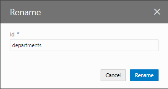

[Oracle VBCS はじめての Web アプリケーション開発](../../README.md) >
[パート3: データを参照・作成するページの作成](README.md)

## ページの名前の変更

このパートではここまでに、次の3つのページを新たに作成しました。

* CreateDepartment（部門レコードの作成） -- ビジネス・オブジェクト Department のレコードを作成
* Employees（従業員一覧） -- ビジネス・オブジェクト Employee の一覧を表形式で表示
* CreateEmployee（従業員レコードの作成） -- ビジネス・オブジェクト Employee のレコードを作成

これらのページにあわせて、main-start ページの名前を Departments に変更してみます。

##### 【ステップ 1】

アーティファクト・ブラウザの **「Web Applications」**

タブ・ページで **「HRWebApp」** → **「flows」** → **「main」** ノードを展開し、 **「main-start」** ページを右クリックします。

##### 【ステップ 2】

**「Rename」** ダイアログ・ボックスが表示されたら、 **「Id」** を `main-start` から `Departments` に変更し、 **「Rename」** ボタンをクリックします。

##### 【ステップ 3】

アーティファクト・ブラウザで、main-start ページが Departments に変更されていることを確認します。

##### 【ステップ 4】

アプリケーション・デザイナの

（Settings）をクリックします。
**「Default Page」** で、 **「departments」** が選択されていることを確認します。

  

次に[パート4: ページ間のナビゲーションの設定](../part4/README.md)に進みます。
