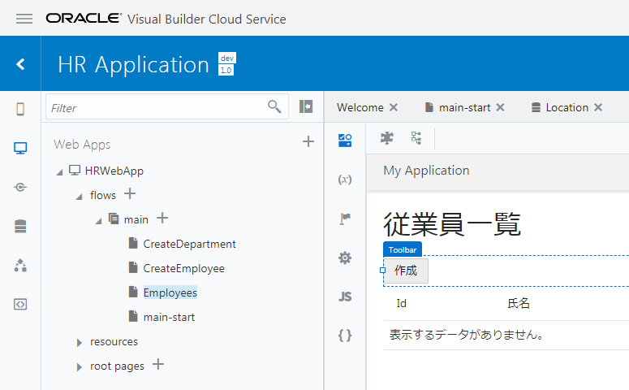
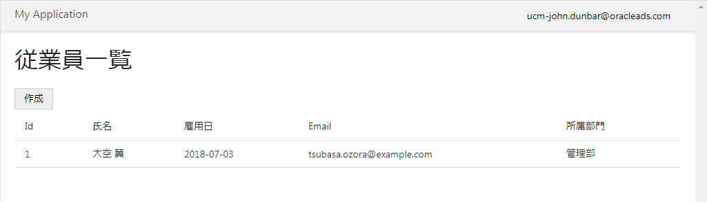

[Oracle VBCS はじめての Web アプリケーション開発](../../README.md) >
[パート3: データを参照・作成するページの作成](README.md)

## Employee のレコードを作成するページの追加

### ページの作成

##### 【ステップ 1】

[『Employee のレコードの一覧を表示するページの追加』](add_employees_table.md) で作成した Employees（従業員一覧）ページをアプリケーション・デザイナの

（Designer）タブ・ページで開きます。

追加された Table コンポーネントのプロパティ・インスペクタで

（Quick Start）タブを開き、 **「Add Create page」** をクリックします。

##### 【ステップ 2】

**「Add Create page」** ダイアログ・ボックスが表示されます。
**「Select Endpoint」** ページでは、REST API のエンドポイントを選択します。
**「Business Objects」** → **「Employee」** を選択し、 **「Next」** ボタンをクリックします。

##### 【ステップ 3】

**「Add Create page」** ダイアログ・ボックスの **「Page Details」** ページでは、レコードを作成するフォームで値を指定する Employee ビジネス・オブジェクトのフィールドを選択します。
**「name」**、**「hireDate」**、**「email」**、**「department」** をチェックします。

画面右側の **「Button label」** テキスト・フィールドの値を `作成` に変更します。
次に、**「Page Title」** テキスト・フィールドの値を `従業員レコードの作成` に変更します。
**「Page name」** は`CreateEmploye`を入力して **「Finish」** ボタンをクリックします。

##### 【ステップ 4】

**「Add Create Page」** ダイアログ・ボックスで **「Finish」** ボタンをクリックすると、main-start ページの Heading コンポーネントと Table コンポーネントの間に Toolbar コンポーネントが追加されています。
Toolbar コンポーネントの中には、**「作成」** ボタンが配置されています。

### 作成したページの動作確認

##### 【ステップ 1】

アーティファクト・ブラウザで **「CreateEmployee」** ページをクリックし、アプリケーション・デザイナで開きます。

##### 【ステップ 2】

画面右上にある **「Live」** ボタンをクリックして、ライブ・モードを有効します。
適当なデータを入力して、**「Save」** ボタンをクリックします。

##### 【ステップ 3】

アーティファクト・ブラウザで **「Employees」** をクリックし、Employees（従業員一覧）ページをアプリケーション・デザイナの

（Designer）タブ・ページで開きます。

Employees ページをアプリケーション・デザイナで開きます。
テーブルにこのセクションで追加したデータが表示されない場合は、

（Reload Page）ボタンをクリックして、ページの再読み込みを実行します。

##### 【ステップ 5】

画面右上にある **「Code」** ボタンをクリックすると、Employees ページの HTML ソースを確認したり、直接編集したりすることができます。

`div` タグや `h1` タグなど通常の HTML タグのほかに、`oj-table` など、名前が `oj-` で始まるタグが使用されています。
`oj-` で名前が始まるタグは、 [Oracle JavaScript Extension Toolkit (JET)](http://oraclejet.org) が提供するコンポーネントです。

**「Design」** ボタンをクリックして、デザイナ・ビューに戻ります。  

次に[ページの名前の変更](change_page_name.md)に進みます。
