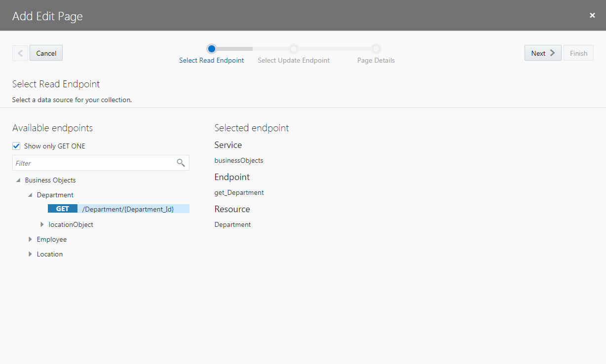
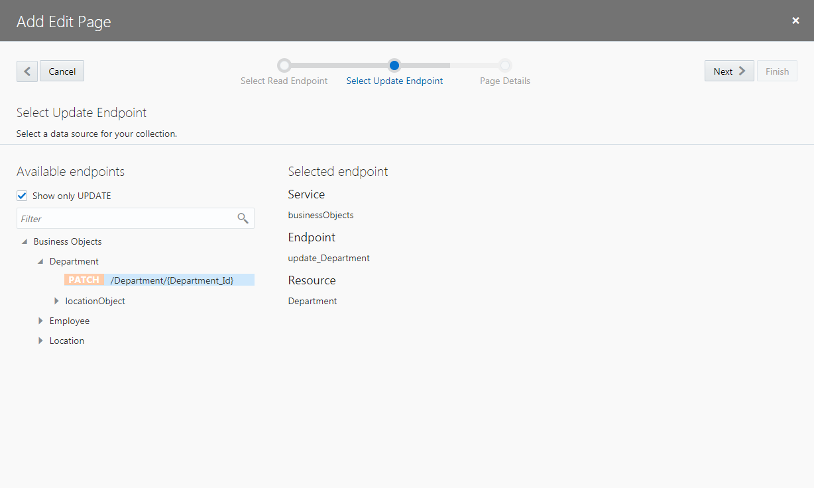
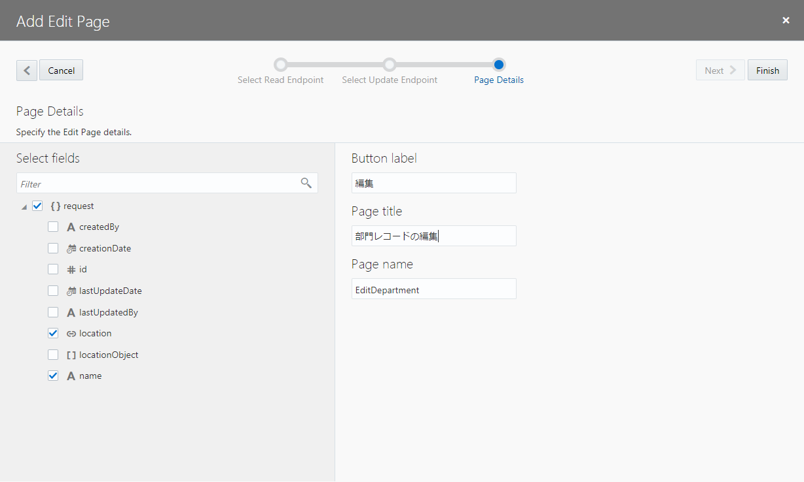

[Oracle VBCS はじめての Web アプリケーション開発](../../README.md) >
[パート5: Department のレコードの編集、詳細ページの作成](README.md)

## レコードを編集するページの作成

##### 【ステップ 1】

アプリケーション・デザイナで Departments（部門一覧）ページを開き、[『Department のレコードの一覧を表示するテーブルの追加』](../part3/add_departments_table.md) で追加した Table コンポーネントを選択します。
Table コンポーネントのプロパティ・インスペクタで

（Quick Start）アイコンをクリックし、**「Add Edit Page」** をクリックします。

##### 【ステップ 2】

**「Add Edit Page」** ダイアログ・ボックスが表示されます。
**「Select Read Endpoint」** ページでは、編集するレコードのデータを取得する際にコールする REST エンドポイントを指定します。
**「Business Objects」** → **「Department」** ノードの下にある **「GET /Department/{Department_Id}」** が選択されていることを確認したら **「Next」** ボタンをクリックします。

##### 【ステップ 3】

**「Add Edit Page」** ダイアログ・ボックスの **「Select Update Endpoint」** ページでは、レコードを更新する際にコールする REST エンドポイントを指定します。
**「Business Objects」** → **「Department」** ノードの下にある **「PATCH /Department/{Department_Id}」** が選択されていることを確認したら **「Next」** ボタンをクリックします。

##### 【ステップ 4】

**「Add Edit Page」** ダイアログ・ボックスの **「Page Details」** ページの **「Select fields」** で **「name」** と **「location」** を順番にチェックします。

画面右側の **「Button label」** テキスト・フィールドの値を `編集` に変更します。
次に、**「Page Title」** テキスト・フィールドの値を `部門レコードの作成` に変更します。

**「Page name」** はデフォルトの値（`EditDepartment`）を使用することにして、**「Finish」** ボタンをクリックします。

##### 【ステップ 5】

**「Add Edit Page」** ダイアログ・ボックスで **「Finish」** ボタンをクリックすると、Departments ページの Heading コンポーネントと Table コンポーネントの間の Toolbar コンポーネントの中には、**「編集」** ボタンが配置されています。
追加された **「編集」** ボタンは、テーブルでレコードが選択されるまでは無効化されています。

また、アーティファクト・ブラウザの Web Applications　タブ・ページで **「HRWebApp」** → **「flows」** → **「main」** ノードを展開すると、 **「EditDepartment」** ページが追加されています。
