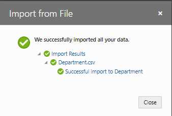
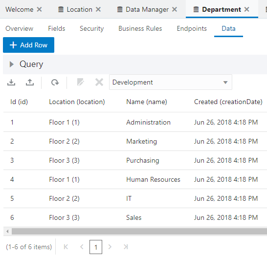

[Oracle VBCS はじめての Web アプリケーション開発](../../README.md) >
[パート5: Department のレコードの編集、詳細ページの作成](README.md)

## データのインポート

##### 【ステップ 1】

[Department.csv](Department.csv) をダウンロードします。

##### 【ステップ 2】

アーティファクト・ブラウザで

（Business Objects）タブをクリックします。

##### 【ステップ 3】

**「Department」** をクリックしてアプリケーション・デザイナで開きます。
**「Data」** タブ・ページで

（Import from File）アイコンをクリックします。

##### 【ステップ 4】

**「Confirm Import Data」** ダイアログ・ボックスが表示されます。
**「Row Handling」** では、 **「Replace」** を選択します。
**「Replace」** を選択すると、既存のデータを CSV ファイルのデータと置き換えます。

ダイアログ・ボックスの中央にある **「Upload a file or drag it here」** と書かれたボックスをクリックするとファイルを開くウィンドウが表示されるので、このパートのステップ1でダウンロードした `Department.csv` を開き、 **「Import」** ボタンをクリックします。

##### 【ステップ 5】

**「Import from File」** ダイアログ・ボックスにインポートが成功したことを表すメッセージが表示されたら、 **「Close」** ボタンをクリックします。

##### 【ステップ 6】

ビジネス・オブジェクト Department の **「Data」** タブ・ページにインポートされたデータが表示されることを確認します。

  

次に[レコードを編集するページの作成](edit_department.md)に進みます。