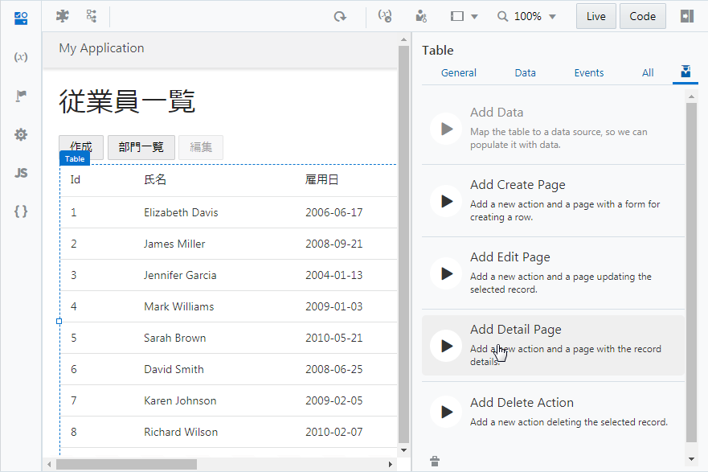

[Oracle VBCS はじめての Web アプリケーション開発](../../README.md) >
[パート6: Employee のレコードの編集、詳細ページの作成](README.md)

## レコードの詳細を表示するページの作成

##### 【ステップ 1】

アプリケーション・デザイナで Employees（従業員一覧）ページを開き、[『Employee のレコードの一覧を表示するテーブルの追加』](../part3/add_employees_table.md) で追加した Table コンポーネントを選択します。
Table コンポーネントのプロパティ・インスペクタで

（Quick Start）アイコンをクリックし、**「Add Detail Page」** をクリックします。

##### 【ステップ 2】

**「Add Detail Page」** ダイアログ・ボックスが表示されます。
**「Select Read Endpoint」** ページでは、レコードのデータを取得する際にコールする REST エンドポイントを指定します。
**「Business Objects」** → **「Employee」** を選択します。
**「Next」** ボタンをクリックします。

##### 【ステップ 3】

**「Add Detail Page」** ダイアログ・ボックスの **「Page Details」** ページでは、ページに表示するビジネス・オブジェクトのフィールドを選択します。
最初に、 **「Select fields」** で **「response」** ツリーの一番下に表示されている **「name」** と **「hireDate」**、**「email」** をチェックします。

次に、**「response」** ツリーの **「departmentObject」** → **「items」** → **「items[i]」** ノードの **「Name」** をチェックします。

画面右側の **「Button label」** テキスト・フィールドの値を `詳細` に変更します。
次に、**「Page Title」** テキスト・フィールドの値を `従業員詳細` に変更します。

**「Page name」** は「EmployeeDetail」`）を入力します。 **「Finish」** ボタンをクリックします。

##### 【ステップ 4】

**「Add Detail Page」** ダイアログ・ボックスで **「Finish」** ボタンをクリックすると、Employees ページの Heading コンポーネントと Table コンポーネントの間の Toolbar コンポーネントの中には、**「詳細」** ボタンが配置されています。
追加された **「詳細」** ボタンは、テーブルでレコードが選択されるまでは無効化されています。

