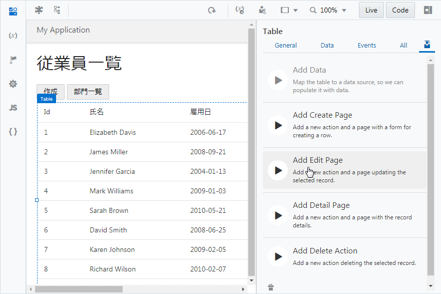
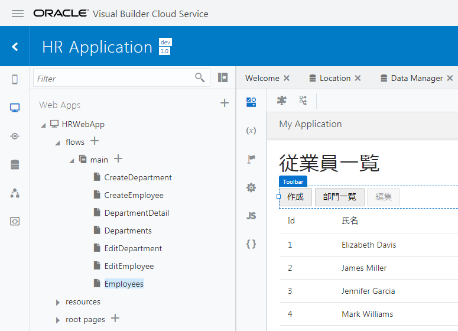

[Oracle VBCS はじめての Web アプリケーション開発](../../README.md) >
[パート6: Employee のレコードの編集、詳細ページの作成](README.md)

## レコードを編集するページの作成

##### 【ステップ 1】

アプリケーション・デザイナで Employees（従業員一覧）ページを開き、[『Employee のレコードの一覧を表示するページの追加』](../part3/add_employees_table.md) で追加した Table コンポーネントを選択します。
Table コンポーネントのプロパティ・インスペクタで

（Quick Start）アイコンをクリックし、**「Add Edit Page」** をクリックします。

##### 【ステップ 2】

**「Add Edit Page」** ダイアログ・ボックスが表示されます。
**「Select Endpoint」** ページでは、編集するレコードのデータを取得する際にコールする REST エンドポイントを指定します。
**「Business Objects」** → **「Employee」** ノードの下にある **「GET /Employee/{Employee_Id}」** が選択されていることを確認したら **「Next」** ボタンをクリックします。

##### 【ステップ 3】

**「Add Edit Page」** ダイアログ・ボックスの **「Select Update Endpoint」** ページでは、レコードを更新する際にコールする REST エンドポイントを指定します。
**「Business Objects」** → **「Employee」** を選択します。 **「Next」** ボタンをクリックします。

##### 【ステップ 4】

**「Add Edit Page」** ダイアログ・ボックスの **「Page Details」** ページの **「Select fields」** で **「name」** と **「hireDate」**、**「email」**、**「department」** を順番にチェックします。

画面右側の **「Button label」** テキスト・フィールドの値を `編集` に変更します。
次に、**「Page Title」** テキスト・フィールドの値を `従業員レコードの作成` に変更します。

**「Page name」** に「`EditEmployee」を入力します。 **「Finish」** ボタンをクリックします。

##### 【ステップ 5】

**「Add Edit Page」** ダイアログ・ボックスで **「Finish」** ボタンをクリックすると、Employees ページの Heading コンポーネントと Table コンポーネントの間の Toolbar コンポーネントの中には、**「編集」** ボタンが配置されています。
追加された **「編集」** ボタンは、テーブルでレコードが選択されるまでは無効化されています。

