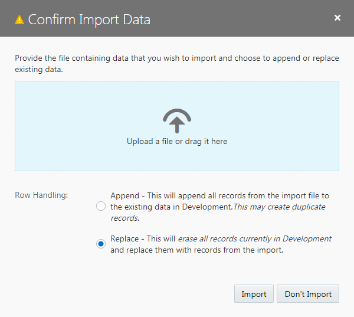
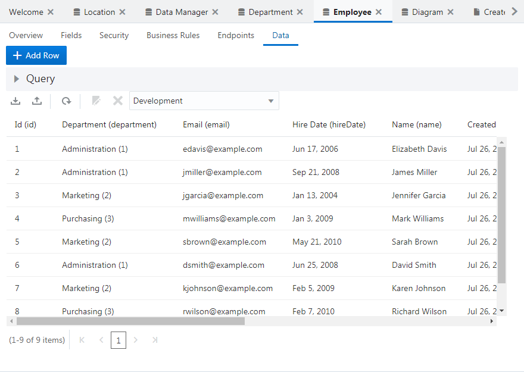

[Oracle VBCS はじめての Web アプリケーション開発](../../README.md) >
[パート6: Employee のレコードの編集、詳細ページの作成](README.md)

## データのインポート

##### 【ステップ 1】{#part6-1-1}

[Employee.csv](Employee.csv) をダウンロードします。

##### 【ステップ 2】

アーティファクト・ブラウザで

（Business Objects）タブをクリックします。

##### 【ステップ 3】

**「Employee」** をクリックしてアプリケーション・デザイナで開きます。
**「Data」** タブ・ページで

（Import from File）アイコンをクリックします。

##### 【ステップ 4】

**「Confirm Import Data」** ダイアログ・ボックスが表示されます。
**「Row Handling」** では、 **「Replace」** を選択します。
**「Replace」** を選択すると、既存のデータを CSV ファイルのデータと置き換えます。

ダイアログ・ボックスの中央にある **「Upload a file or drag it here」** と書かれたボックスをクリックするとファイルを開くウィンドウが表示されるので、このパートの[ステップ1](#part6-1-1)でダウンロードした `Employee.csv` を開き、 **「Import」** ボタンをクリックします。

##### 【ステップ 5】

**「Import from File」** ダイアログ・ボックスにインポートが成功したことを表すメッセージが表示されたら、 **「OK」** ボタンをクリックします。

##### 【ステップ 6】

ビジネス・オブジェクト Employee の **「Data」** タブ・ページにインポートされたデータが表示されることを確認します。

