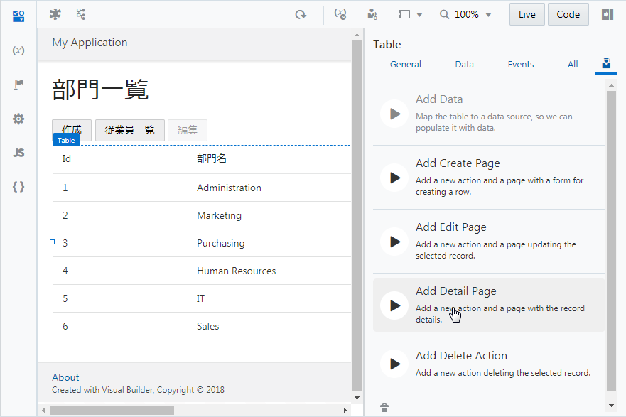
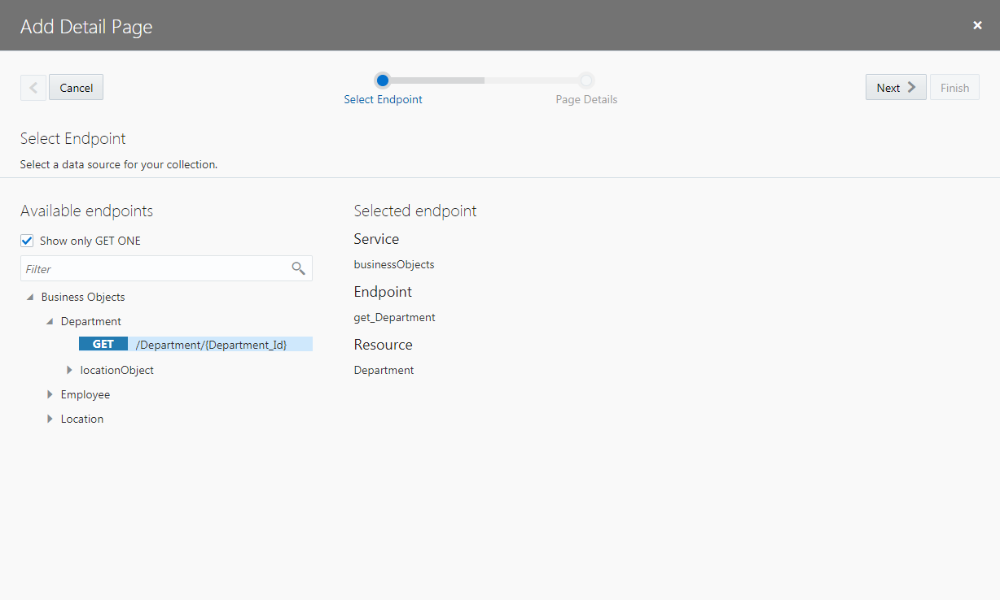
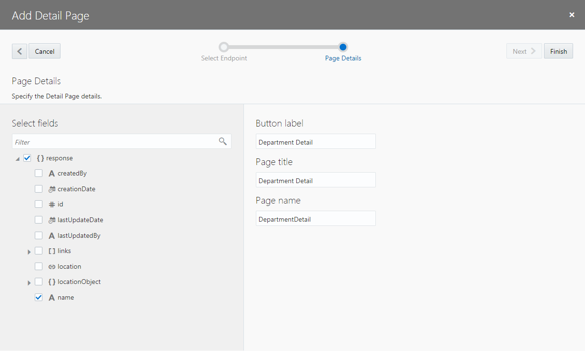
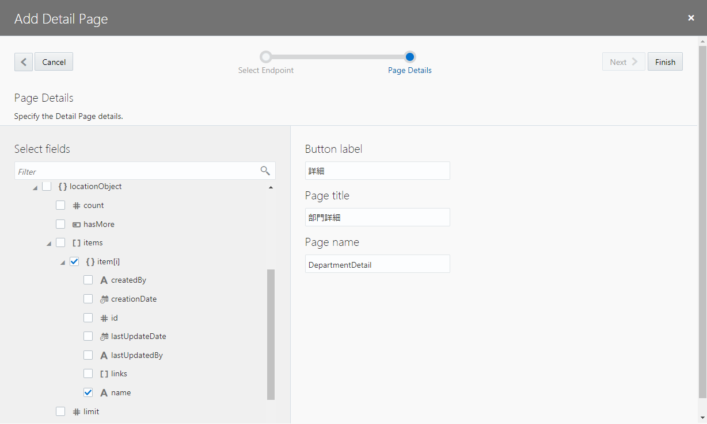

[Oracle VBCS はじめての Web アプリケーション開発](../../README.md) >
[パート5: Department のレコードの編集、詳細ページの作成](README.md)

## レコードの詳細を表示するページの作成

##### 【ステップ 1】

アプリケーション・デザイナで Departments （部門一覧）ページを開き、[『Department のレコードの一覧を表示するテーブルの追加』](../part3/add_departments_table.md) で追加した Table コンポーネントを選択します。
Table コンポーネントのプロパティ・インスペクタで

（Quick Start）アイコンをクリックし、**「Add Detail Page」** をクリックします。

##### 【ステップ 2】

**「Add Detail Page」** ダイアログ・ボックスが表示されます。
**「Select Read Endpoint」** ページでは、レコードのデータを取得する際にコールする REST エンドポイントを指定します。
**「Business Objects」** → **「Department」** ノードの下にある **「GET /Department/{Department_Id}」** が選択されていることを確認したら **「Next」** ボタンをクリックします。

##### 【ステップ 3】

**「Add Detail Page」** ダイアログ・ボックスの **「Page Details」** ページでは、ページに表示するビジネス・オブジェクトのフィールドを選択します。
最初に、 **「Select fields」** で **「response」** ツリーの一番下に表示されている **「name」** をチェックします。

次に、**「response」** ツリーの **「locationObject」** → **「items」** → **「items[i]」** ノードの **「Name」** をチェックします。

画面右側の **「Button label」** テキスト・フィールドの値を `詳細` に変更します。
次に、**「Page Title」** テキスト・フィールドの値を `部門詳細` に変更します。

**「Page name」** はデフォルトの値（`DepartmentDetail`）を使用することにして、**「Finish」** ボタンをクリックします。

##### 【ステップ 4】

**「Add Detail Page」** ダイアログ・ボックスで **「Finish」** ボタンをクリックすると、Departments ページの Heading コンポーネントと Table コンポーネントの間の Toolbar コンポーネントの中には、**「詳細」** ボタンが配置されています。
追加された **「詳細」** ボタンは、テーブルでレコードが選択されるまでは無効化されています。

また、アーティファクト・ブラウザの Web Applications　タブ・ページで **「HRWebApp」** → **「flows」** → **「main」** ノードを展開すると、 **「DepartmentDetail」** ページが追加されています。
