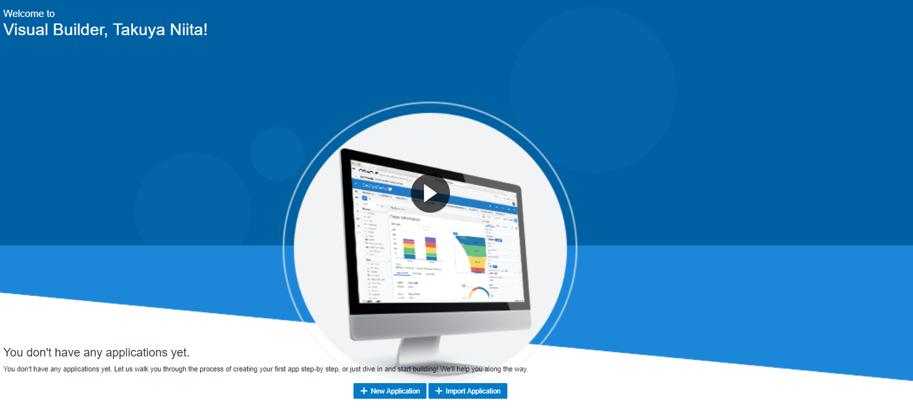
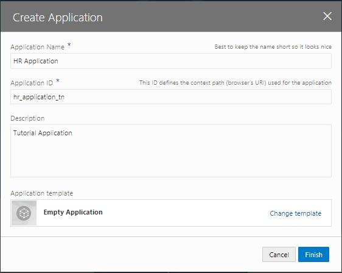
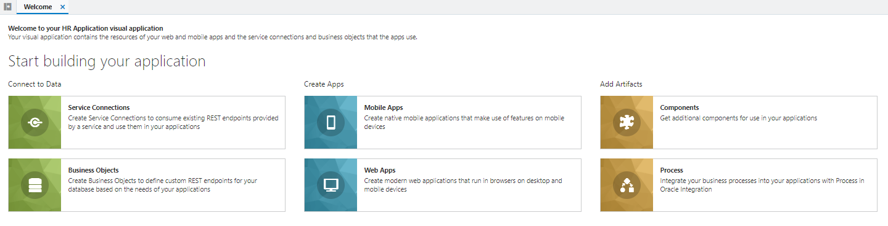

# ビジュアル・アプリケーションの作成

Oracle Visual Builder (VBCS) では、最初に ***ビジュアル・アプリケーション*** を作成します。
ビジュアル・アプリケーションは、Web アプリケーションやモバイル・アプリケーションを開発するために使用するリソースの集まりです。
アプリケーションのソース・ファイルや、メタデータが記述された JSON ファイルを含んでいます。

1.  Web ブラウザを使用して Oracle Visual Builder Cloud Service（以下 VBCS）にログインします。

1.  VBCS の **「Visual Applications」** ページが表示されたら、**「New Application」** ボタンをクリックします。

    

1.  **「Create Application」** ダイアログ・ボックスが表示されます。
    次の表のように設定します。

    | 設定項目 | 設定する値 | 説明 |
    |--------|--------|--------|
    |**「Application name」**|`HR Application`|アプリケーションにつける名前|
    |**「Id」**|`hr_application_<xx>`|アプリケーションのID。アプリケーションの URL にも用いられるので、VBCSのインスタンス内で一意である必要があります。 *&lt;xx&gt;* の部分はご自身のイニシャルなどと置き換えてください。|
    |**「Description」**|`Tutorial Application`|アプリケーションの簡単な説明|
    |**「Application template」**| `Empty Application` (デフォルト) | アプリケーションのテンプレート|

    

    値を設定したら、**「Create Application」** ダイアログ・ボックスの **「Finish」** ボタンをクリックします。

ビジュアル・アプリケーションが作成されると、VBCSのアプリケーション・デザイナでビジュアル・アプリケーションがオープンします。
アプリケーション・デザイナにはアーティファクト・ブラウザとWelcomeスクリーンが表示されます。
Welcomeスクリーンには、VBCSでアプリケーションを作成するためのタスクのガイドが表示されます。

アプリケーション・デザイナの左側の領域はアーティファクト・ブラウザと呼ばれる領域で、アプリケーションを構成する各種ソース・ファイル（HTML/CSS/JavaScriptなど）や、データ・アクセスや画面フローの設定などアプリケーションを実行する際に必要となるメタデータ（JSONファイル）が表示され、アクセスできます。

アーティファクト・デザイナには、次のタブ・ページがあります。

* Service Connections
* Business Objects
* Mobile Applications
* Web Applications
* Components
* Processes

画面上部のアプリケーションの名前（Application nameとして指定したテキスト）の右隣に表示される **「dev」** と **「1.0」** はそれぞれ、アプリケーションのステータス（development: 開発中を表す）とバージョンを表しています。

次に[Webアプリケーションの作成](create_web_app.md)に進みます。
