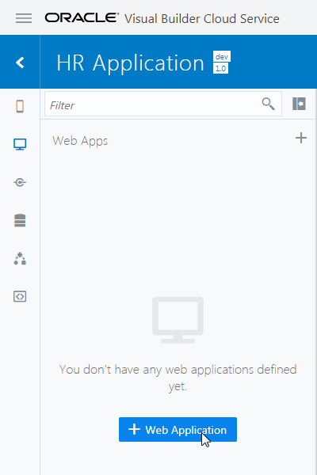
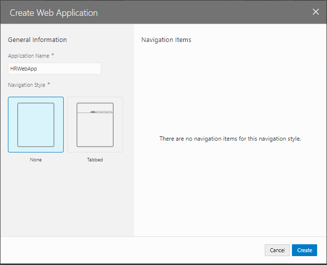
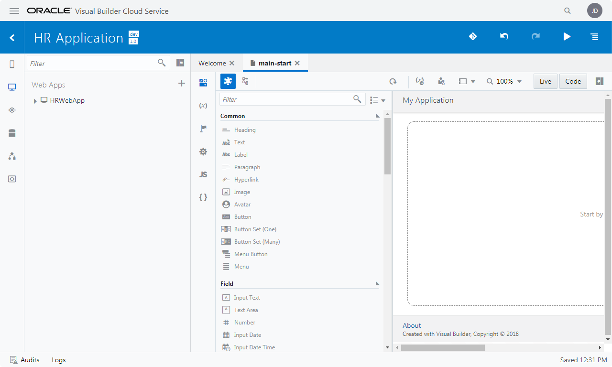
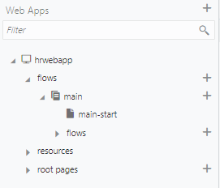

# Web アプリケーションの作成

VBCS のビジュアル・アプリケーションは、1つ以上のWebアプリケーションまたはモバイル・アプリケーションを持ちます。
このチュートリアルでは、Webアプリケーションを作成します。

1.  アーティファクト・ブラウザの **「Web Applications」** タブ
    
    をクリックします。
    **「+ Web Application」** ボタン（またはアーティファクト・ブラウザの右上にある **「＋」** アイコン）をクリックします。

    

1.  **「Create Web Application」** ダイアログ・ボックスが表示されたら、 **「Application Name」** フィールドに `HRWebApp` と入力し、 **Navigation Style** に`None`を選択し、 **「Create」** ボタンをクリックします。

    

1.  HRWebApp のアーティファクトが生成されます。
    ページ・デザイナで表示されている **「main-start」** が、アプリケーションの起動時に最初に表示される画面です。

    

1.  アーティファクト・ブラウザで **「HRWebApp」** ノードを展開するとWebアプリケーションの構造が表示されます。
    **「flows」** ノードと **「main」** ノードを展開すると **「main-start」** ページが表示されます。

    

次に[パート2:ビジネス・オブジェクトの作成](../part2/README.md)に進みます。
