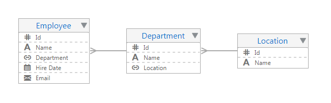

# パート2: ビジネス・オブジェクトの作成

このパートでは、[パート1](../part1/README.md)で作成したビジュアル・アプリケーションにビジネス・オブジェクトを作成します。
ビジネス・オブジェクトは、アプリケーションで扱うデータを保持するためのリソースです。
ビジュアル・アプリケーションにビジネス・オブジェクトを作成すると、データを格納するためのデータベース・テーブルが自動的に作成され、そのデータを参照、作成、更新、削除するためのREST APIにアクセスできるようになります。

このパートでは、次の3つのビジネス・オブジェクトを作成します。

* Location: オフィスの所在地のデータ
* Department: 部門のデータ
* Employee: 従業員のデータ

次の図は、このパートで作成する3つのビジネス・オブジェクト間の関係をダイアグラムで表したものです。

----

1. [ビジネス・オブジェクト Location の作成](create_bo_location.md)
1. [ビジネス・オブジェクト Department の作成](create_bo_department.md)
1. [ビジネス・オブジェクト Employee の作成](create_bo_employee.md)

----
