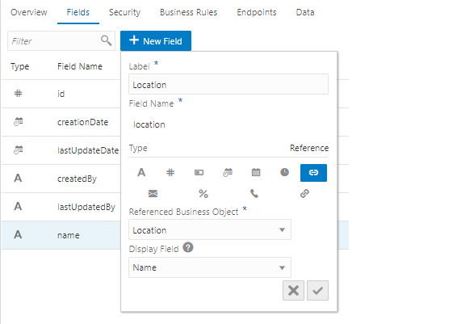
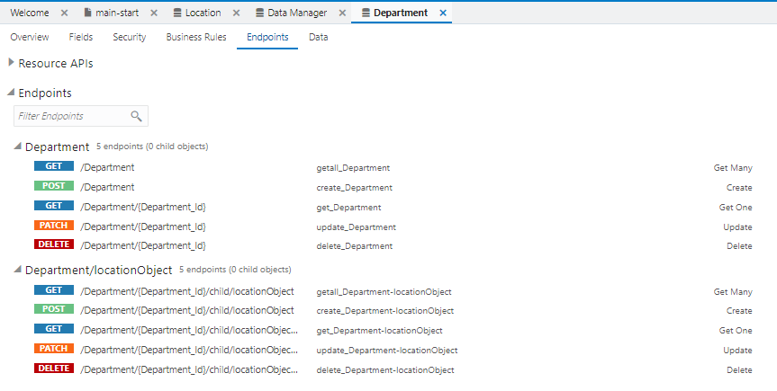

# ビジネス・オブジェクト Department の作成

ここでは、部門を表すビジネス・オブジェクト Department を作成します。

ビジネス・オブジェクト Department を作成するためには、事前にビジネス・オブジェクト Location を作成してある必要があります。
ビジネス・オブジェクト Location の作成手順は『[ビジネス・オブジェクト Location の作成](create_bo_location.md)』で説明しています。

## ビジネス・オブジェクトの作成

1.  アーティファクト・ブラウザの **「Business Objects」** タブ
    
    をクリックします。

1.  アーティファクト・ブラウザの右上部にある **「+」** （Create Business Object）アイコンをクリックします。

1.  **「New Business Object」** ポップアップ・ボックスが表示されたら、次の表のように設定して、
    
    （Create）ボタンをクリックします。

    | 設定項目 | 設定する値 |
    |---|---|
    | **「Label」** | `Department` |
    | **「Name」** | `Department` |

## フィールド name の作成

1.  ビジネス・オブジェクト Department の **「Fields」** タブ・ページの **「+ New Field」** ボタンをクリックします。

1.  ポップアップ・ボックスが表示されたら、追加するフィールドの設定を表 2-2-2のように設定し、
    
    （Create）ボタンをクリックします。

    | 設定項目 | 設定する値 |
    |---|---|
    | **「Label」** | `Name` |
    | **「Field Name」** | `name` |
    | **「Type」** | **「String」**  を選択 |

1.  フィールド Name が追加されると画面の右端のプロパティ・エディタに Name のプロパティが表示されます。
    **「Constraints」** の下にある **「Required」** をチェックします。

1.  プロパティ・エディタで **「Required」** をチェックすると、追加されたフィールド Name は必須データ項目に設定されます。
    **「Required」** 列にチェック・マークが表示されていることを確認します。

## フィールド location の作成

1.  ビジネス・オブジェクト Department の **「Fields」** タブ・ページの **「+ New Field」** ボタンをクリックします。

1.  ポップアップ・ボックスが表示されたら、追加するフィールドの設定を次の表のように設定し、
    
    （Create）ボタンをクリックします。

    | 設定項目 | 設定する値 | 説明 |
    |---|---|---|
    | **「Label」** | `Location` |  |
    | **「Field Name」** | `location` |  |
    | **「Type」** | **「Reference」**  を選択 |  |
    | **「Reference Business Object」** | **「Location」** を選択 | 作成するフィールドがデータを参照するビジネス・オブジェクトを選択 |
    | **「Default Display Field」** | **「Name」** を選択 | データを編集する際のリストの表示に使用される、参照先のビジネス・オブジェクト（今回は Location）のフィールドを選択 |

    

1.  ビジネス・オブジェクト Department の **「Endpoints」** タブ・ページを開きます。
    ビジネス・オブジェクト Department のデータを操作するためのエンドポイントが一覧できます。

    

    ビジネス・オブジェクト Department は Location を参照しているので、 `/Department/{Department_Id}/child/locationObject` というエンドポイントで Department が参照している Location のデータにアクセスできます。

次に[ビジネス・オブジェクト Employeeの作成](create_bo_employee.md)に進みます。
