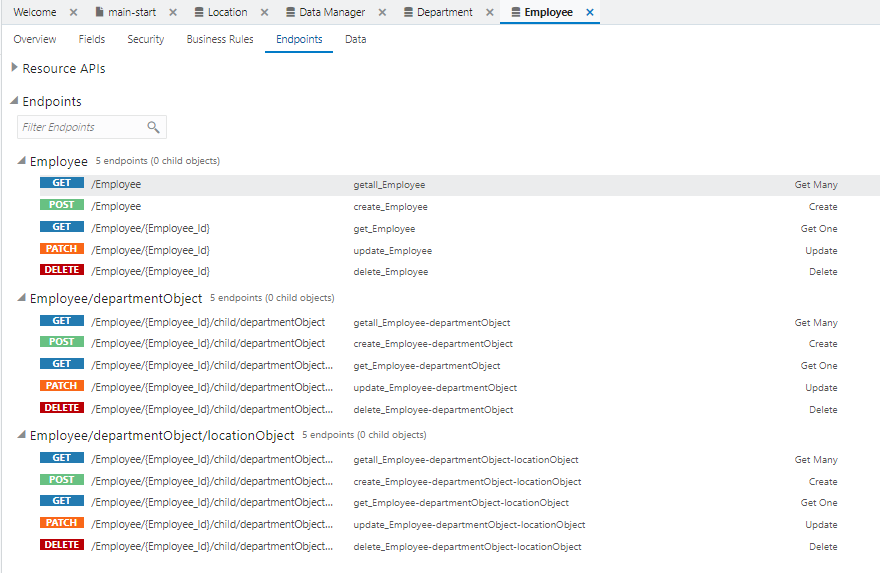

# ビジネス・オブジェクト Employee の作成

ここでは、従業員を表すビジネス・オブジェクト Employee を作成します。

ビジネス・オブジェクト Employee を作成するためには、事前にビジネス・オブジェクト Location と Department を作成してある必要があります。
ビジネス・オブジェクト Location の作成手順は『[ビジネス・オブジェクト Location の作成](create_bo_location.md)』で、Department の作成手順は『[ビジネス・オブジェクト Department の作成](create_bo_department.md)』でそれぞれ説明しています。

## ビジネス・オブジェクトの作成

1.  アーティファクト・ブラウザの **「Business Objects」** タブ
    
    をクリックします。

1.  アーティファクト・ブラウザの右上部にある **「+」** （Create Business Object）アイコンをクリックします。

1.  **「New Business Object」** ポップアップ・ボックスが表示されたら、次の表のように設定して、
    
    （Create）ボタンをクリックします。

    | 設定項目 | 設定する値 |
    |---|---|
    | **「Label」** | `Employee` |
    |**「Name」** | `Employee` |

## フィールド name の作成

1.  ビジネス・オブジェクト Employee の **「Fields」** タブ・ページの **「+ New Field」** ボタンをクリックします。

1.  ポップアップ・ボックスが表示されたら、追加するフィールドの設定を次の表のように設定し、 **「Create」** ボタンをクリックします。

    | 設定項目 | 設定する値 |
    |---|---|
    | **「Label」** | `Name` |
    | **「Field Name」** | `name` |
    | **「Type」** | **「String」**  を選択 |

1.  フィールド Name が追加されると画面の右端のプロパティ・エディタに Name のプロパティが表示されます。
    **「Constraints」** の下にある **「Required」** をチェックします。

1.  プロパティ・エディタで **「Required」** をチェックすると、追加されたフィールド Name は必須データ項目に設定されます。
    **「Required」** 列にチェック・マークが表示されていることを確認します。

## フィールド department の作成

1.  ビジネス・オブジェクト Employee の **「Fields」** タブ・ページの **「+ New Field」** ボタンをクリックします。

1.  ポップアップ・ボックスが表示されたら、追加するフィールドの設定を次の表のように設定し、
    
    （Create）ボタンをクリックします。

    | 設定項目 | 設定する値 |
    |---|---|
    | **「Label」** |`Department`|
    | **「Field Name」** |`department`|
    | **「Type」** |**「Reference」**  を選択 |
    | **「Reference Business Object」** | **「Department」** を選択 |
    | **「Default Display Field」** | **「Name」** を選択 |

## フィールド hireDate の作成

1.  ビジネス・オブジェクト Employee の **「Fields」** タブ・ページの **「+ New Field」** ボタンをクリックします。

1.  ポップアップ・ボックスが表示されたら、追加するフィールドの設定を表 2-3-4のように設定し、
    
    （Create）ボタンをクリックします。

    | 設定項目 | 設定する値 |
    |---|---|
    | **「Label」** | `Hire Date` |
    | **「Field Name」** | `hireDate` |
    | **「Type」** |**「Date」**  を選択 |

## フィールド email の作成

1.  ビジネス・オブジェクト Employee の **「Fields」** タブ・ページの **「+ New Field」** ボタンをクリックします。

1.  ポップアップ・ボックスが表示されたら、追加するフィールドの設定を表 2-3-5のように設定し、
    
    （Create）ボタンをクリックします。

    | 設定項目 | 設定する値 |
    |---|---|
    | **「Label」** | `Email` |
    | **「Field Name」** | `email` |
    | **「Type」** | **「Email」**  を選択 |

1.  4つのフィールドを追加したら、ビジネス・オブジェクト Employee の **「Endpoints」** タブ・ページを開きます。

    

    Employee は Department を参照し、 DepartmentはLocation を参照しているので、それぞれのノードを展開するとこのパートで作成した3つのビジネス・オブジェクトすべてにアクセスできることがわかります。

次に[パート3:ビジネス・オブジェクトを参照・作成するページの作成](../part3/README.md)に進みます。
