[Oracle VBCS はじめての Web アプリケーション開発](../../README.md) >
[パート3: データを参照・作成するページの作成](README.md)

## Department のレコードの一覧を表示するテーブルの追加

### 見出しの追加

##### 【ステップ 1】

アーティファクト・ブラウザの **「Web Applications」** タブ

をクリックします。

##### 【ステップ 2】

**「flows」** および **「main」** ノードを展開し、**「main-start」** をクリックします。
アプリケーション・デザイナで main-start ページが表示されます。

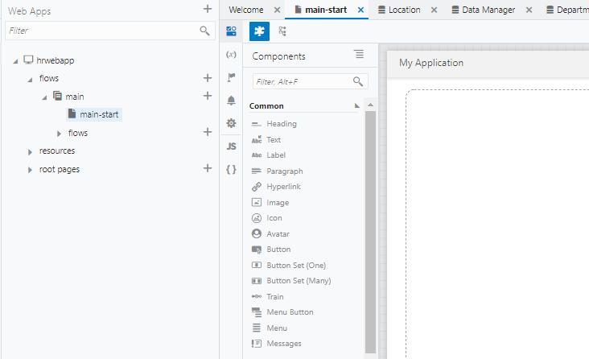

デザイナ・ツールの左側には、コンポーネント・パレットが表示されます。
コンポーネント・パレットは、デザイナの左上にある

（Component Palette）アイコンで表示/非表示を切り替えることができます。

また、アーティファクト・ナビゲータも表示/非表示を切り替えることができます。
アーティファクト・ナビゲータ非表示にするには、右上にある
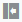
（Collapse App Nav）アイコンをクリックします。
アーティファクト・ブラウザが非表示のときに
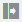
（Expand App Nav）アイコンをクリックすると、再びアーティファクト・ブラウザが表示されます。

##### 【ステップ 3】

ページに見出しを追加します。
コンポーネント・パレットの **「Common」** の下にある **「Heading」** コンポーネントをページにドラッグ＆ドロップします。

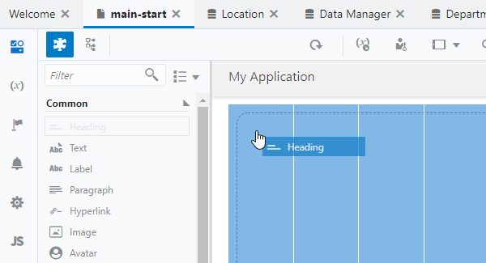

##### 【ステップ 4】

ページに Heading コンポーネントが追加されると、プロパティ・インスペクタで Heading コンポーネントの設定を変更できます。
デザイナ・ツールの右側にプロパティ・インスペクタが表示されない場合は、画面右上に表示される
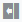
（Collapse Property Inspector）アイコンをクリックします。

Heading コンポーネントのプロパティ・インスペクタで、 **「Text」** フィールドに `部門一覧` と入力します。

### テーブルの追加

##### 【ステップ 1】

コンポーネント・パレットを下にスクロールし、 **「Collection」** カテゴリの **「Table」** コンポーネントを、追加済みの Heading コンポーネントの下にドラッグ＆ドロップします。

##### 【ステップ 2】

追加された Table コンポーネントのプロパティ・インスペクタで

（Quick Start）タブを開き、**「Add Data」** をクリックします。

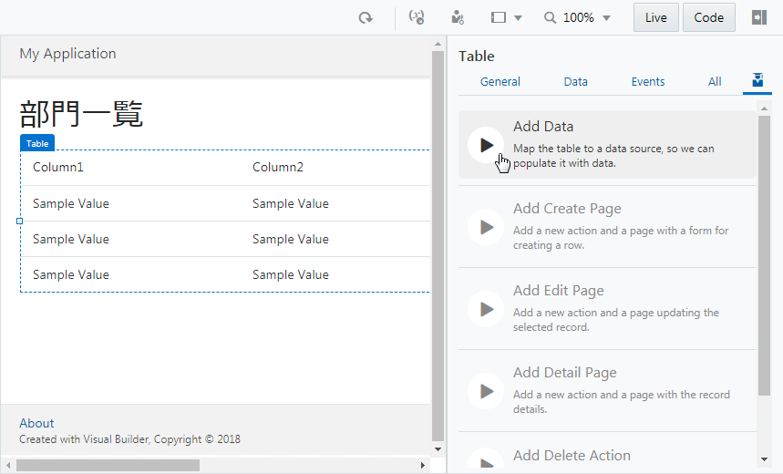

##### 【ステップ 3】

**「Add Data」** ダイアログ・ボックスが表示されます。
**「Locate Data」** ページでは、テーブルに表示するデータを取得する REST エンドポイントを選択します。
**「Business Objects」** の **「Department」** を選択します。  
この手順により、REST エンドポイント（`GET /Department`）にてデータを取得する設定ができます。

**「Next」** ボタンをクリックします。

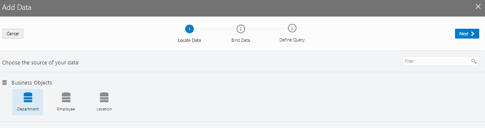

##### 【ステップ 4】

**「Add Data」** ダイアログ・ボックスの **「Bind Data」** ページでは、テーブルの列を選択します。
**「item[i]」** ノードの下の **「id」** と **「name」** を順番に選択します。

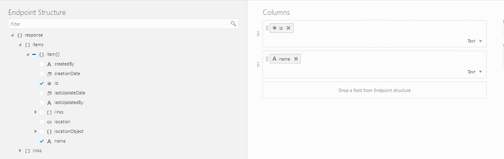

**「Add Data」** ダイアログ・ボックスの右側にあるColumnsリストに、 **「items/id」**、 **「items/name」** の順に表示されていることを確認します。
表示されている順番が異なる場合は、部分をドラッグ ＆ ドロップして順番を入れ替えます。

##### 【ステップ 5】

次に、 **「locationObject」** とその下の **「items」** ノードを展開します。
このとき、 **「item[i]」** ノードも同時に展開されるので、**「name」** をチェックします。

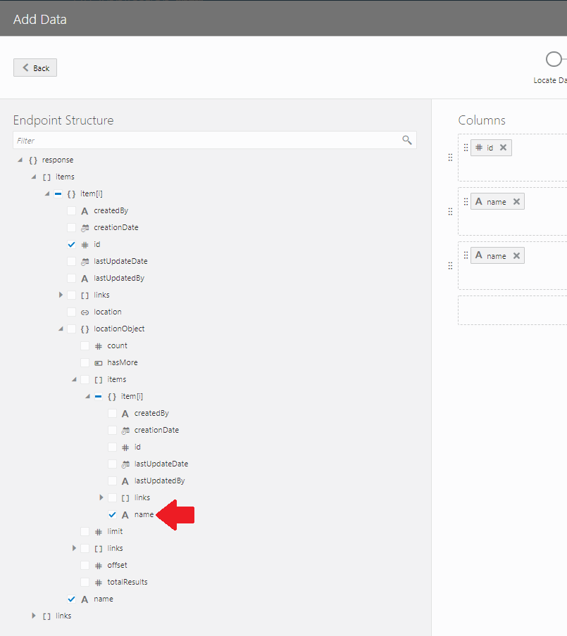

**「Columns」** リストの一番下に、**「name」** が追加されていることを確認したら、**「Next」** ボタンをクリックします。

##### 【ステップ 6】

**「Add Data」** ダイアログ・ボックスの **「Define Query」** ページでは、そのまま **「Finish」** ボタンをクリックします。

### 追加されたテーブルの設定の確認と変更

##### 【ステップ 1】

アプリケーション・デザイナの

（Variables & Types）アイコンをクリックします。
アプリケーション・デザイナの Variables エディタでは、ページに定義された変数が一覧できます。
main-start ページには、 **「departmentListSDP」** という名前の変数が定義されています。

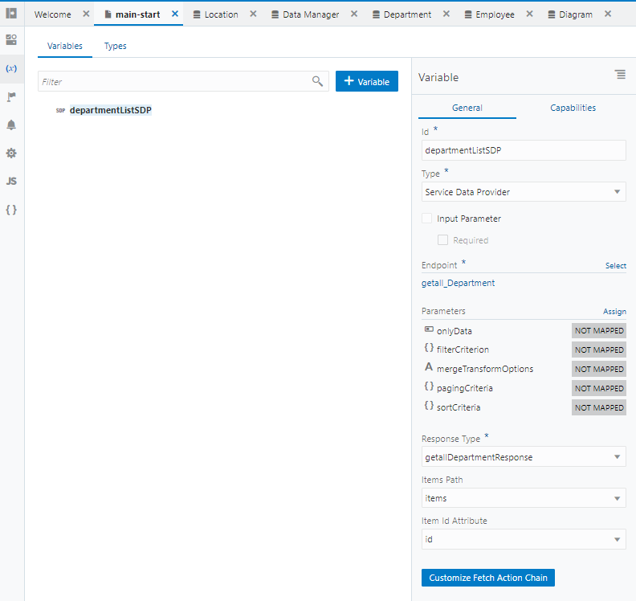

この変数は、Quick Start メニューによって設定した REST エンドポイント（`GET /Department`）によって取得したデータを保持します。

##### 【ステップ 2】

アプリケーション・ナビゲータの
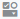
（Designer）アイコンをクリックします。
追加されたテーブルをクリックし、プロパティ・インスペクタの **「Data」** タブ・ページを開きます。
**「Data」** フィールドには、テーブルに表示するデータの設定が記述されています。

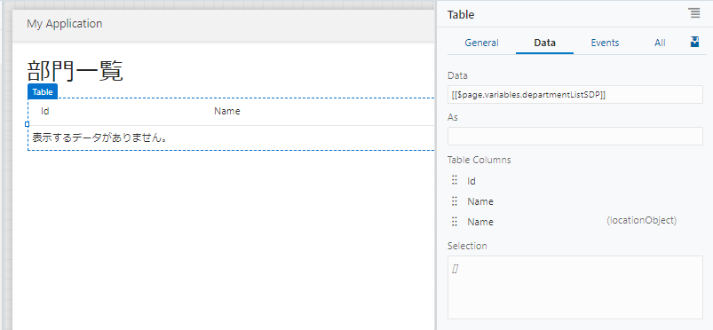

##### 【ステップ 3】

テーブル・コンポーネントのプロパティ・インスペクタの **「Data」** タブ・ページでは、テーブルの列ヘッダーのテキストを変更できます。

- **「Table Columns」** リストの上から二番目の **「Name」** をクリックして `部門名` に変更します。
- **「Table Columns」** リストの一番下に表示されている **「Name」** をクリックして `所在地` に変更します。

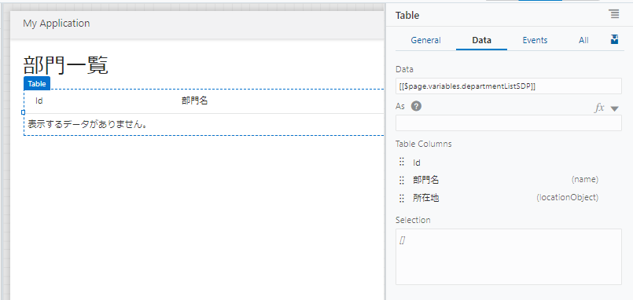  

次に[Department のレコードを作成するページの追加](create_department.md)に進みます。
