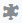
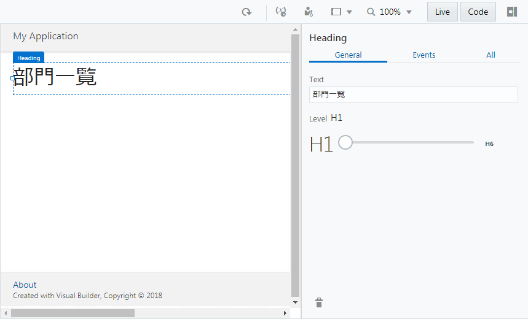
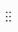
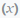

# Department のレコードの一覧を表示するテーブルの追加

## 見出しの追加

1.  アーティファクト・ブラウザの **「Web Applications」** タブ
    
    をクリックします。

1.  **「flows」** および **「main」** ノードを展開し、**「main-start」** をクリックします。
    アプリケーション・デザイナで main-start ページが表示されます。

    

    アプリケーション・デザイナの左側には、コンポーネント・パレットが表示されます。
    コンポーネント・パレットは、デザイナの左上にある
    
    （Component Palette）アイコンで表示/非表示を切り替えることができます。

    また、アーティファクト・ナビゲータも表示/非表示を切り替えることができます。
    アーティファクト・ナビゲータ非表示にするには、右上にある
    
    （Collapse App Nav）アイコンをクリックします。

    アーティファクト・ブラウザが非表示のときに
    
    （Expand App Nav）アイコンをクリックすると、再びアーティファクト・ブラウザが表示されます。

1.  ページに見出しを追加します。
    コンポーネント・パレットの **「Common」** の下にある **「Heading」** コンポーネントをページにドラッグ＆ドロップします。

    

1.  ページに Heading コンポーネントが追加されると、プロパティ・インスペクタで Heading コンポーネントの設定を変更できます。
    デザイナ・ツールの右側にプロパティ・インスペクタが表示されない場合は、画面右上に表示される
    
    （Collapse Property Inspector）アイコンをクリックします。

    Heading コンポーネントのプロパティ・インスペクタで、 **「Text」** フィールドに `部門一覧` と入力します。

    

## テーブルの追加

1.  コンポーネント・パレットを下にスクロールし、 **「Collection」** カテゴリの **「Table」** コンポーネントを、追加済みの Heading コンポーネントの下にドラッグ＆ドロップします。

    

1.  追加された Table コンポーネントのプロパティ・インスペクタで
    
    （Quick Start）タブを開き、**「Add Data」** をクリックします。

    

1.  **「Add Data」** ダイアログ・ボックスが表示されます。
    **「Locate Data」** ページでは、テーブルに表示するデータを取得する REST エンドポイントを選択します。
    **「Business Objects」** の **「Department」** を選択します。  
    この手順により、REST エンドポイント（`GET /Department`）にてデータを取得する設定ができます。

    

    **「Next」** ボタンをクリックします。

1.  **「Add Data」** ダイアログ・ボックスの **「Bind Data」** ページでは、テーブルの列を選択します。
    **「item[i]」** ノードの下の **「id」** と **「name」** を順番に選択します。

    

    **「Add Data」** ダイアログ・ボックスの右側にあるColumnsリストに、 **「items/id」**、 **「items/name」** の順に表示されていることを確認します。
    表示されている順番が異なる場合は、
    
    をドラッグ ＆ ドロップして順番を入れ替えます。

1.  次に、 **「locationObject」** とその下の **「items」** ノードを展開します。
    このとき、 **「item[i]」** ノードも同時に展開されるので、**「name」** をチェックします。

    

    **「Columns」** リストの一番下に、**「name」** が追加されていることを確認したら、**「Next」** ボタンをクリックします。

1.  **「Add Data」** ダイアログ・ボックスの **「Define Query」** ページでは、そのまま **「Finish」** ボタンをクリックします。

    

## 追加されたテーブルの設定の確認と変更

1.  アプリケーション・デザイナの
    
    （Variables & Types）アイコンをクリックします。
    アプリケーション・デザイナの Variables エディタでは、ページに定義された変数が一覧できます。
    main-start ページには、 **「departmentListSDP」** という名前の変数が定義されています。

    

    この変数は、Quick Start メニューによって設定した REST エンドポイント（`GET /Department`）によって取得したデータを保持します。

1.  アプリケーション・ナビゲータの
    
    （Designer）アイコンをクリックします。
    追加されたテーブルをクリックし、プロパティ・インスペクタの **「Data」** タブ・ページを開きます。
    **「Data」** フィールドには、テーブルに表示するデータの設定が記述されています。

    

1.  テーブル・コンポーネントのプロパティ・インスペクタの **「Data」** タブ・ページでは、テーブルの列ヘッダーのテキストを変更できます。

    - **「Table Columns」** リストの上から二番目の **「Name」** をクリックして `部門名` に変更します。
    - **「Table Columns」** リストの一番下に表示されている **「Name」** をクリックして `所在地` に変更します。

    

次に[Department のレコードを作成するページの追加](create_department.md)に進みます。
