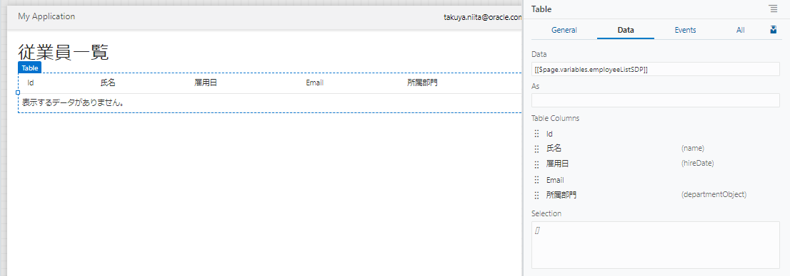

# Employee のレコードの一覧を表示するページの追加

## ページの作成

1.  アーティファクト・ブラウザの **「Web Applications」** タブ
    
をクリックします。
    **「HRWebApp」** → **「flows」** ノードを展開し、 **「main」** ノードの右に表示される **「＋」** アイコン（Create Page）をクリックします。

    

1.  **「Create Page」** ダイアログ・ボックスが表示されます。
    **「Id」** フィールドに初期表示される `main-` を削除し、 `Employees` と入力します。

    

    **「Create」** ボタンをクリックすると、Employees ページが作成され、アプリケーション・デザイナで表示されます。

1.  コンポーネント・パレットの **「Common」** の下にある **「Heading」** コンポーネントを Employees　ページにドラッグ＆ドロップします。

1.  Heading コンポーネントのプロパティ・インスペクタで、 **「Text」** フィールドに `従業員一覧` と入力します。

## テーブルの追加

1.  コンポーネント・パレットを下にスクロールし、 **「Collection」** カテゴリの **「Table」** コンポーネントを、追加済みの Heading コンポーネントの下にドラッグ＆ドロップします。

1.  追加された Table コンポーネントのプロパティ・インスペクタで
    
    （Quick Start）タブを開き、**「Add Data」** をクリックします。

1.  **「Add Data」** ダイアログ・ボックスが表示されます。
    **「Locate Data」** ページでは、テーブルに表示するデータを取得する REST エンドポイントを選択します。
    **「Business Objects」** → **「Employee」** を選択します。

1.  **「Add Data」** ダイアログ・ボックスの **「Bind Data」** ページでは、テーブルの列を選択します。
    **「item[i]」** ノードの下に表示されている **「id」**、**「name」**、**「hireDate」**、**「email」** を順番にチェックします。

    **「Add Data」** ダイアログ・ボックスの右側に表示される **「Columns」** リストに、次の順番で表示されていることを確認します。

    1. id
    1. name
    1. hireDate
    1. email

    表示されている順番が異なる場合は、
    
    アイコンをドラッグ ＆ ドロップして順番を入れ替えます。

1.  さらに同ページの **「departmentObject」** → **「items」** ノードを展開すると、その下にある **「item[i]」** ノードが自動的に展開されます。
    **「Name」** をチェックしてから **「Next」** ボタンをクリックします。

1.  **「Add Data」** ダイアログ・ボックスの **「Define Query」** ページでは、そのまま **「Finish」** ボタンをクリックします。

1.  追加された Table コンポーネントのプロパティ・インスペクタを開き、 **「Data」** タブをクリックします。
    次の表のようにテーブルの列ヘッダーのテキストを変更します。

    | 変更前 | 変更後 |
    |---|---|
    | Name （**「Table Columns」** リストの上から2番目）| 氏名 |
    | Hire Date | 雇用日 |
    | Name （**「Table Columns」** リストの上から2番目）| 所属部門 |

    　　

----

次に[Employee のレコードを作成するページの追加](create_employee.md)に進みます。
