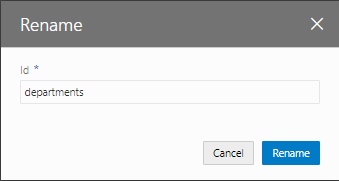
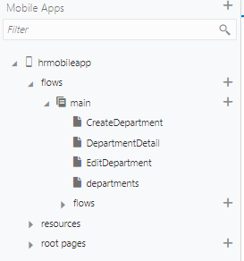
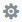
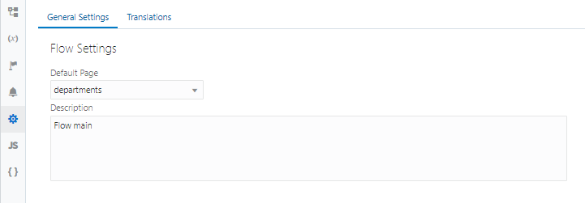

# ページの名前の変更

このパートではここまでに、次の3つのページを新たに作成しました。

* CreateDepartment（部門レコードの作成） -- ビジネス・オブジェクト Department のレコードを作成
* Employees（従業員一覧） -- ビジネス・オブジェクト Employee の一覧を表形式で表示
* CreateEmployee（従業員レコードの作成） -- ビジネス・オブジェクト Employee のレコードを作成

これらのページにあわせて、main-start ページの名前を Departments に変更してみます。

1.  アーティファクト・ブラウザの **「Web Applications」**
    
    タブ・ページで **「HRWebApp」** → **「flows」** → **「main」** ノードを展開し、 **「main-start」** ページを右クリックします。

1.  **「Rename」** ダイアログ・ボックスが表示されたら、 **「Id」** を `main-start` から `departments` に変更し、 **「Rename」** ボタンをクリックします。

    

1.  アーティファクト・ブラウザで、main-start ページが departments に変更されていることを確認します。

    

1.  アーティファクト・ブラウザの **「Web Applications」**
    
    タブ・ページで **「HRWebApp」** → **「flows」** → **「main」** をクリックし、
    
    （Settings）をクリックします。  
    **「Default Page」** で、 **「departments」** が選択されていることを確認します。

      

次に[パート4: ページ間のナビゲーションの設定](../part4/README.md)に進みます。
