# Department のレコードを作成するページの追加

## ページの作成

1.  アプリケーション・デザイナで main-start ページを開き、[『Department のレコードの一覧を表示するテーブルの追加』](add_departments_table.md) で追加した Table コンポーネントを選択します。
    Table コンポーネントのプロパティ・インスペクタで
    
    （Quick Start）アイコンをクリックし、**「Add Create Page」** をクリックします。

1.  **「Add Create Page」** ダイアログ・ボックスが表示されます。
    **「Select Endpoint」** ページでは、レコードを作成する際にコールする REST エンドポイントを指定します。
    **「Business Objects」** → **「Department」** を選択します。  
    この設定により、REST エンドポイント（`POST /Department`）にてデータを登録する設定ができます。  

    **「Next」** ボタンをクリックします。

1.  **「Add Create Page」** ダイアログ・ボックスの **「Page Details」** ページの **「Select fields」** で **「name」** と **「location」** を順番にチェックします。
    ここで選択されたフィールドは、データを作成するフォームで値を入力できます。
    ビジネス・オブジェクト Department の location フィールドは、ビジネス・オブジェクト Location のデータを参照するように設定したので、作成フォームではドロップダウン・リストから値を選択できるようになります。

    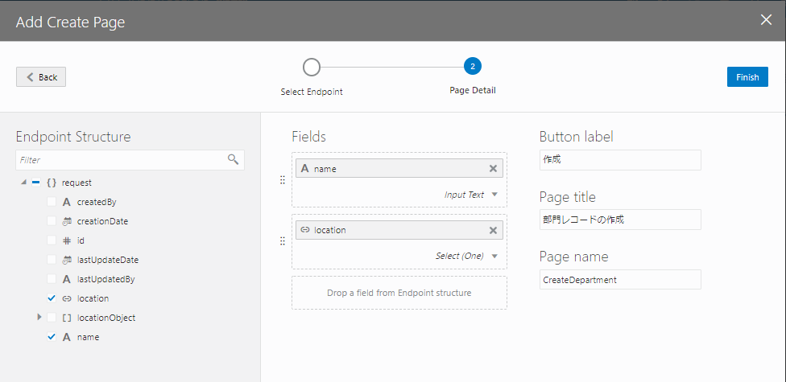

    画面右側の **「Button label」** テキスト・フィールドの値を `作成` に変更します。
    クリックすると作成されるページにナビゲートするボタンのラベル・テキストが **「作成」** に設定されます。

    次に、**「Page Title」** テキスト・フィールドの値を `部門レコードの作成` に変更します。
    作成されるページのタイトルに使用されます。

    **「Page name」** には`CreateDepartment`を入力して、**「Finish」** ボタンをクリックします。

1.  **「Add Create Page」** ダイアログ・ボックスで **「Finish」** ボタンをクリックすると、main-start ページの Heading コンポーネントと Table コンポーネントの間に Toolbar コンポーネントが追加されます。
    Toolbar コンポーネントの中には、**「作成」** ボタンが配置されています。

    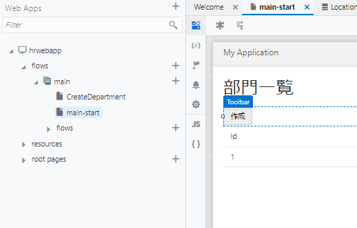

## 作成したページの動作確認

1.  アーティファクト・ブラウザで **「CreateDeparment」** ページをクリックし、アプリケーション・デザイナで開きます。

1.  画面右上にある **「Live」** ボタンをクリックすると、ボタンが緑色に変化します。
    これによりデザイナがライブ・モードになり、CreateDepartment ページの動作確認が可能な状態になります。

    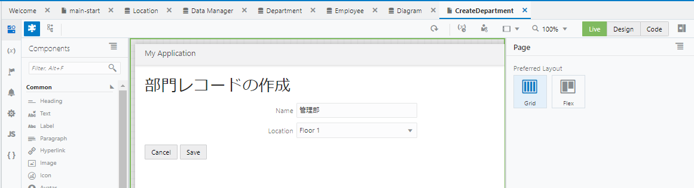

    **「Name」** フィールドに `管理部` と入力し、 **「Location」** フィールドで **「Floor 1」** を選択したら、 **「Save」** ボタンをクリックします。

1.  main-start ページをアプリケーション・デザイナで開きます。
    テーブルにこのセクションで追加したデータが表示されない場合は、
    
    （Reload Page）ボタンをクリックして、ページの再読み込みを実行します。

    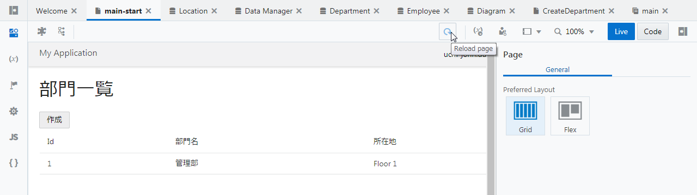

## ページ・ナビゲーションの設定の確認

1.  ライブ・モードが有効になっている（Liveボタンが緑色で表示されている）場合は、 **「Live」** ボタンをクリックしてデザイン・モードに戻します。

1.  main-start ページに追加された **「作成」** ボタンをクリックします。
    プロパティ・インスペクタの **「Events」** タブ・ページを開くと、 **「作成」** ボタンがクリックされる（ojActionイベントが発生する）と **「navigateToCreateDepartmentChain」** という名前のアクション・チェーンが起動されるように設定されていることがわかります。

    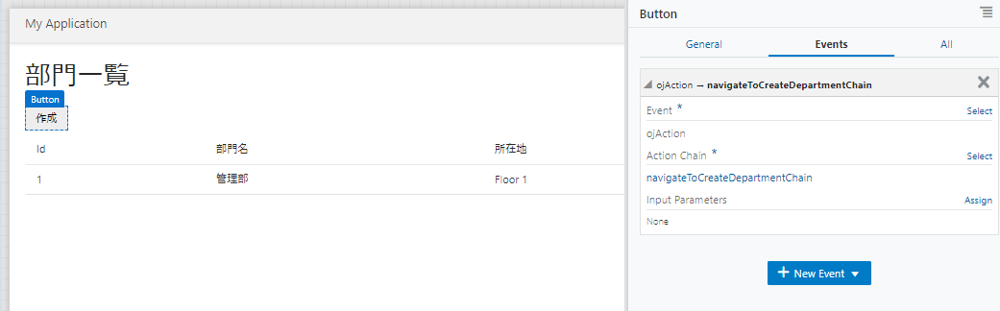

1.  プロパティ・インスペクタの **「Events」** タブ・ページで、 **「Action Chain」** の下に表示されている **「navigateToCreateDepartmentChain」** をクリックします。
    アクション・チェーンの設定がビジュアルに表示されます。

    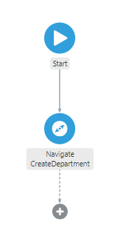

## Department レコードの作成処理の設定の確認

1.  アーティファクト・ブラウザで **「CreateDepartment」** ページをクリックし、
    
    （Variables & Types）タブをクリックします。
    CreateDepartment ページには、2つの変数が定義されていることがわかります。

    - `department` - ビジネス・オブジェクト Department のレコードを作成するためのデータを保持するための変数です。
    `name` は、name フィールドに、 `location` は location フィールドにそれぞれバインドされています。
    - `locationListSDP` - Locationフィールドの選択肢を表示させるために使用されます。

    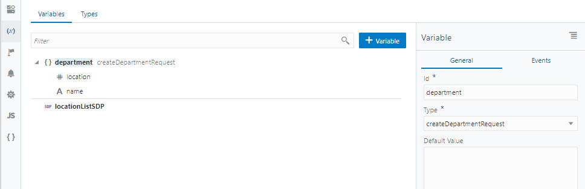

1.  CreateDepartment ページで
    
    （Designer）タブをクリックします。
    **「Save」** ボタンを選択し、プロパティ・インスペクタの **「Event」** タブ・ページを開きます。

    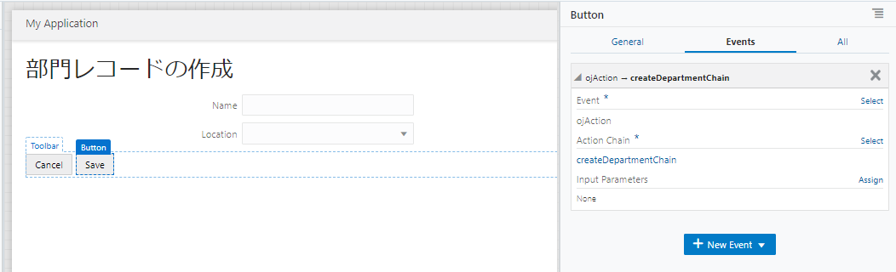

    clickイベントが発生したときはアクション・チェーン **「createDepartmentChain」** が実行されることが確認できます。

1.  プロパティ・インスペクタの **「Event」** タブ・ページでアクション・チェーン **「createDepartmentChain」** をクリックすると、アクション・チェーンの処理フローがビジュアルに表示されます。
    **「Call REST Endpoint businessObjects/create_Department」** で、ビジネス・オブジェクト Department の REST エンドポイント create_Department (POST /Departmen) をコールしています。

    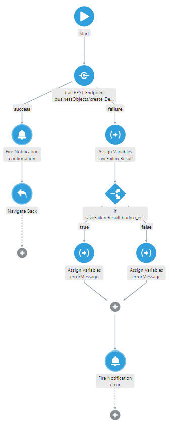

    データの作成が成功した場合は処理が成功したことを通知するメッセージを表示し、ひとつ前の画面にナビゲートします。
    データの作成に失敗した場合は、エラーメッセージを表示します。

1.  アクション・チェーンのダイアログで、 **「Call REST Endpoint businessObjects/create_Department」** をクリックすると、プロパティ・インスペクタで REST エンドポイント呼び出しの設定を確認できます。
    プロパティ・インスペクタを下にスクロールし、 **「Parameters」** の横にある **「Assign」** をクリックします。

    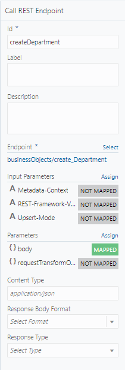

    **「Map Variables To Parameters」** ダイアログ・ボックスが表示されます。

    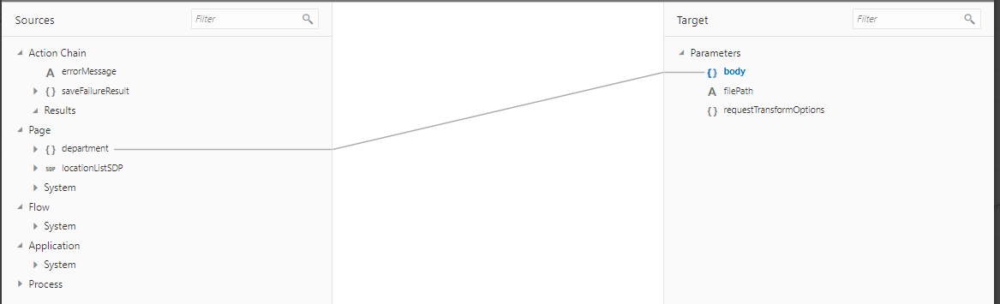

    パラメータ **「body」** には CreateDepartment ページの変数 `department` がマップされていることを確認したら、 **「Cancel」** をクリックしてダイアログ・ボックスを閉じます。  

----

次に[Employee のレコードの一覧を表示するページの追加](add_employees_table.md)に進みます。
