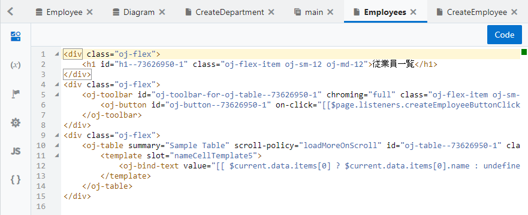

# Employee のレコードを作成するページの追加

## ページの作成

1.  『[Employee のレコードの一覧を表示するページの追加](add_employees_table.md)』で作成した Employees（従業員一覧）ページをアプリケーション・デザイナの
    
    （Designer）タブ・ページで開きます。

    追加された Table コンポーネントのプロパティ・インスペクタで
    
    （Quick Start）タブを開き、 **「Add Create page」** をクリックします。

1.  REST API のエンドポイントを選択します。
    **「Business Objects」** → **「Employee」** を選択し、 **「Next」** ボタンをクリックします。

1.  **「Add Create page」** ダイアログ・ボックスの **「Page Details」** ページでは、レコードを作成するフォームで値を指定する Employee ビジネス・オブジェクトのフィールドを選択します。
    **「name」**、**「hireDate」**、**「email」**、**「department」** をチェックします。

    画面右側の **「Button label」** テキスト・フィールドの値を `作成` に変更します。
    次に、**「Page Title」** テキスト・フィールドの値を `従業員レコードの作成` に変更します。
    **「Page name」** は`CreateEmployee`を入力して **「Finish」** ボタンをクリックします。

1.  **「Add Create Page」** ダイアログ・ボックスで **「Finish」** ボタンをクリックすると、main-start ページの Heading コンポーネントと Table コンポーネントの間に Toolbar コンポーネントが追加されています。
    Toolbar コンポーネントの中には、**「作成」** ボタンが配置されています。

    

## 作成したページの動作確認

1.  アーティファクト・ブラウザで **「CreateEmployee」** ページをクリックし、アプリケーション・デザイナで開きます。

1.  画面右上にある **「Live」** ボタンをクリックして、ライブ・モードを有効します。
    適当なデータを入力して、**「Save」** ボタンをクリックします。

    

1.  アーティファクト・ブラウザで **「Employees」** をクリックし、Employees（従業員一覧）ページをアプリケーション・デザイナの
    
    （Designer）タブ・ページで開きます。

    Employees ページをアプリケーション・デザイナで開きます。
    テーブルにこのセクションで追加したデータが表示されない場合は、
    
    （Reload Page）ボタンをクリックして、ページの再読み込みを実行します。

    

1.  画面右上にある **「Code」** ボタンをクリックすると、Employees ページの HTML ソースを確認したり、直接編集したりすることができます。

    

    `div` タグや `h1` タグなど通常の HTML タグのほかに、`oj-table` など、名前が `oj-` で始まるタグが使用されています。
    `oj-` で名前が始まるタグは、 [Oracle JavaScript Extension Toolkit (JET)](http://oraclejet.org) が提供するコンポーネントです。

    **「Design」** ボタンをクリックして、デザイナ・ビューに戻ります。  

----

次に[ページの名前の変更](change_page_name.md)に進みます。
