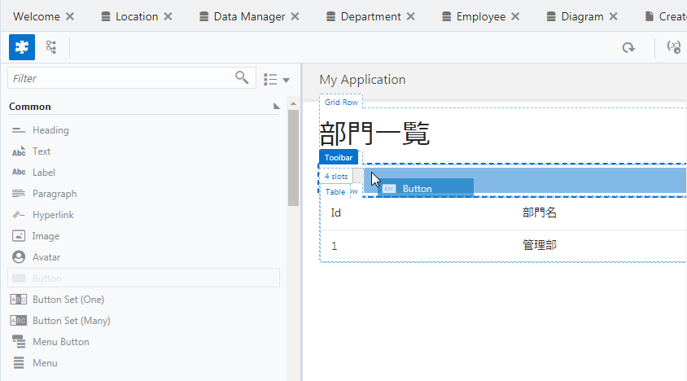
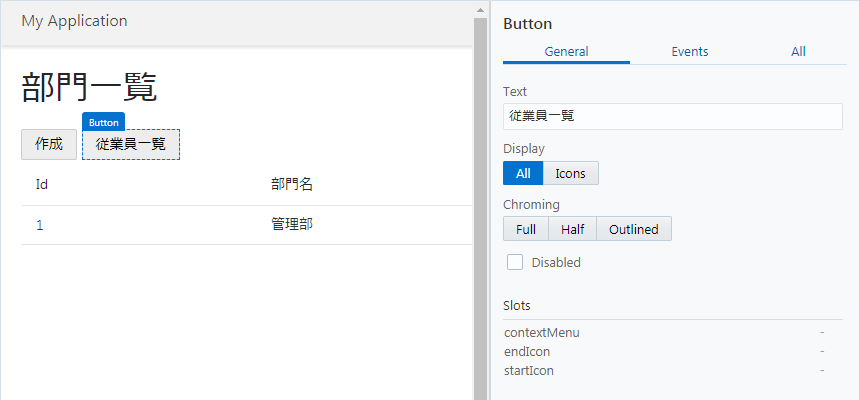
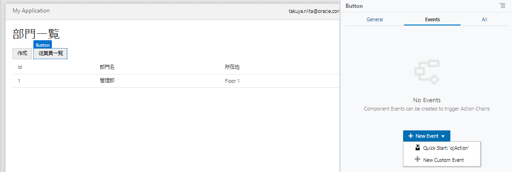
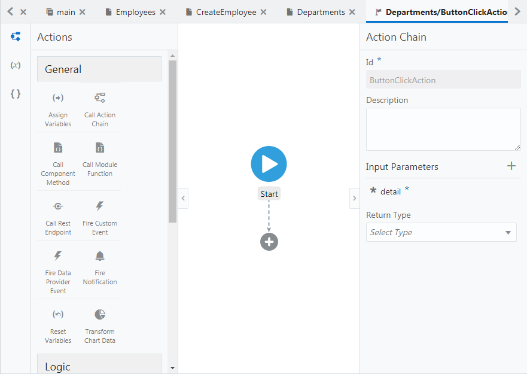
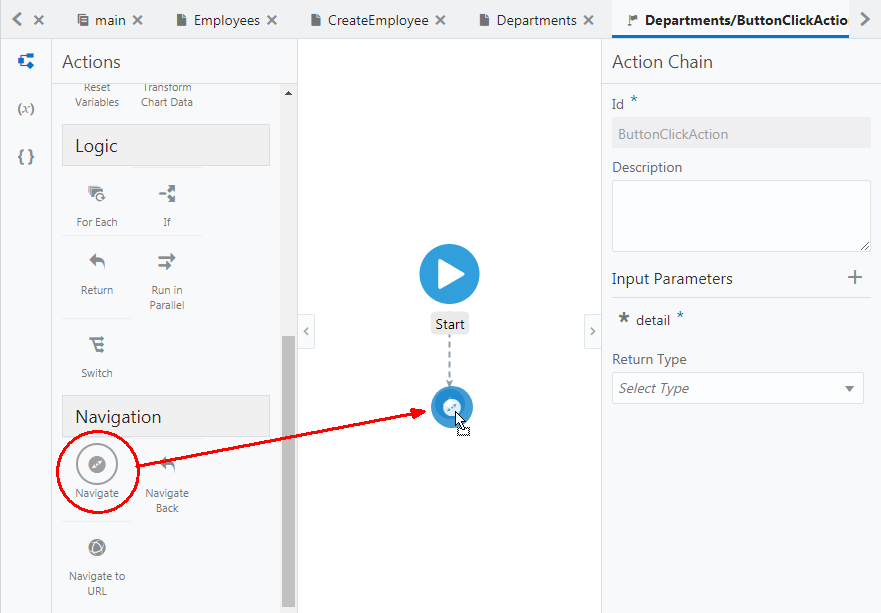
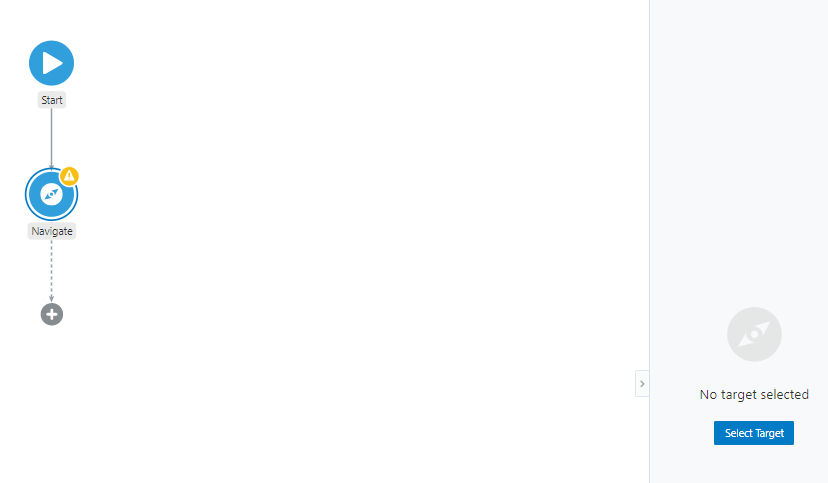
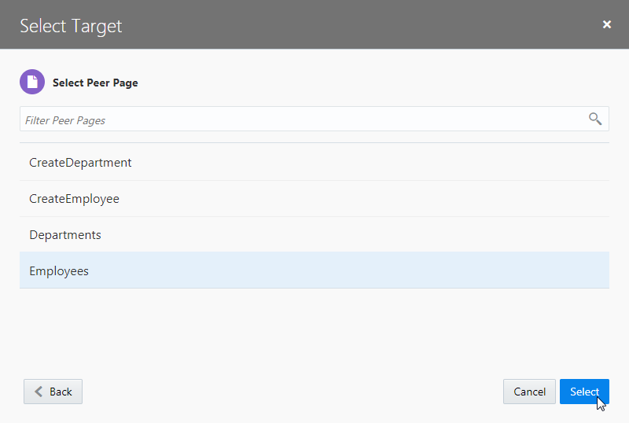
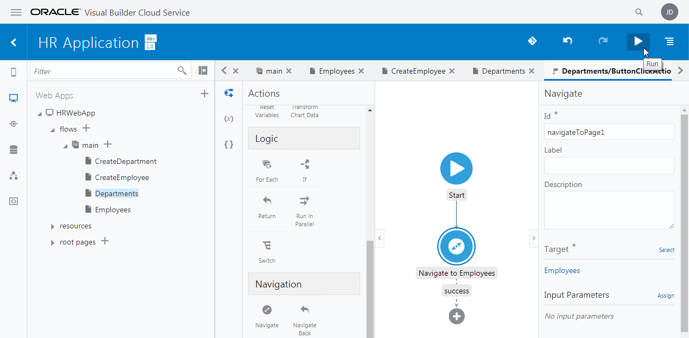

# Departments ページから Employees ページへのナビゲーション

ここでは、Departments （部門一覧）ページに、**「従業員一覧」** ボタンを追加します。
**「従業員一覧」** ボタンをクリックすると Employees ページ（従業員一覧）にナビゲートするように設定します。

1.  アーティファクト・ブラウザの **「Web Applications」** タブ
    
    をクリックします。

    **「HRWebApp」** → **「flows」** → **「main」** ノードを展開して、 **「Departments」** ページを開きます。
    アプリケーション・デザイナの
    
    （Designer）タブ・ページで開きます。

1.  コンポーネント・パレットから、 **「Button」** コンポーネントを Toolbar コンポーネントの中（**「作成」** ボタンの右隣）にドラッグ＆ドロップします。

    

1.  追加した Button コンポーネントのプロパティ・インスペクタを開きます。
    **「General」** タブ・ページの **「Text」** フィールドを `従業員一覧` と編集します。

    

1.  **「従業員一覧」** ボタンのプロパティ・インスペクタで、 **「Events」** タブ・ページを開きます。
    **「+ New Event」** ボタンをクリックすると表示されるメニューから **「Quick Start: 'ojAction'」** を選択します。

    

    これにより、**「従業員一覧」** ボタンがクリックされた時に起動される、 Id が ButtonClickAction のアクション・チェーンが定義されます。

    

1.  画面の左側には、アクション・パレットが表示されています。
    アクション・パレットを下にスクロールし、 **「Navigation」** カテゴリから **「Navigate」** を **「Start」** アクションの下に表示されている **「＋」** マークの上にドラッグ＆ドロップします。

    

1.  画面の右側に **「Navigate」** パネルが表示されたら、 **「Select Target」** ボタンをクリックします。

    

1.  **「Select Target」** ダイアログ・ボックスが表示されたら、 **「Peer Page」** をクリックします。

    

1.  ナビゲート可能なページのリストが表示されるので、 **「Employees」** を選択したら、 **「Select」** ボタンをクリックします。

    

1.  画面右上にある
    
    （Run） ボタンをクリックします。

    

    Departments （部門一覧）ページの **「従業員一覧」** ボタンをクリックし、Employees （従業員一覧）ページにナビゲートされることを確認します。

----

次に[Departments ページから Employees ページへのナビゲーション](employees_to_departments.md)に進みます。
