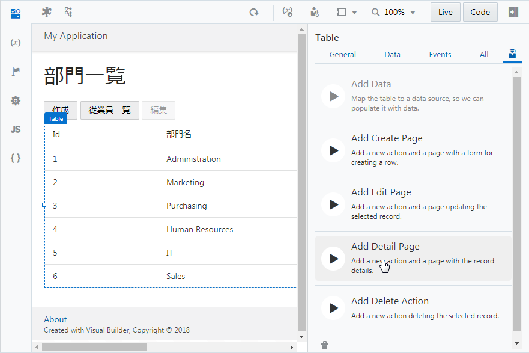

# レコードの詳細を表示するページの作成

1.  アプリケーション・デザイナで Departments （部門一覧）ページを開き、[『Department のレコードの一覧を表示するテーブルの追加』](../part3/add_departments_table.md) で追加した Table コンポーネントを選択します。
    Table コンポーネントのプロパティ・インスペクタで
    
    （Quick Start）アイコンをクリックし、**「Add Detail Page」** をクリックします。

    

1.  **「Add Detail Page」** ダイアログ・ボックスが表示されます。
    **「Select Endpoint」** ページでは、レコードのデータを取得する際にコールする REST エンドポイントを指定します。
    **「Business Objects」** → **「Department」** を選択し、 **「Next」** ボタンをクリックします。

1.  **「Add Detail Page」** ダイアログ・ボックスの **「Page Details」** ページでは、ページに表示するビジネス・オブジェクトのフィールドを選択します。
    最初に、 **「Select fields」** で **「response」** ツリーの一番下に表示されている **「name」** をチェックします。

    次に、**「response」** ツリーの **「locationObject」** → **「items」** → **「items[i]」** ノードの **「Name」** をチェックします。

    画面右側の **「Button label」** テキスト・フィールドの値を `詳細` に変更します。
    次に、**「Page Title」** テキスト・フィールドの値を `部門詳細` に変更します。

    **「Page name」** は「DepartmentDetail」を入力します。
    **「Finish」** ボタンをクリックします。

1.  **「Add Detail Page」** ダイアログ・ボックスで **「Finish」** ボタンをクリックすると、Departments ページの Heading コンポーネントと Table コンポーネントの間の Toolbar コンポーネントの中には、**「詳細」** ボタンが配置されています。
    追加された **「詳細」** ボタンは、テーブルでレコードが選択されるまでは無効化されています。

    

----

次に[パート6: Employee のレコードの編集、詳細ページの作成](../part6/README.md)に進みます。
