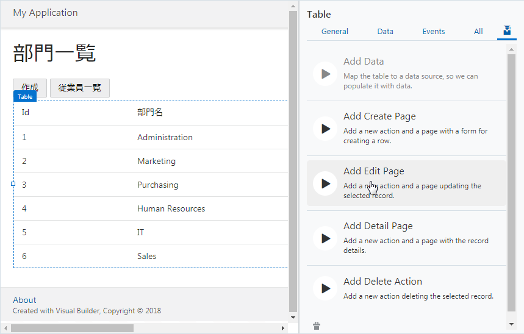

# レコードを編集するページの作成

1.  アプリケーション・デザイナで Departments（部門一覧）ページを開き、『[Department のレコードの一覧を表示するテーブルの追加](../part3/add_departments_table.md)』で追加した Table コンポーネントを選択します。
    Table コンポーネントのプロパティ・インスペクタで
    
    （Quick Start）アイコンをクリックし、**「Add Edit Page」** をクリックします。

    

1.  **「Add Edit Page」** ダイアログ・ボックスが表示されます。
    **「Select Endpoint」** ページでは、編集するレコードのデータを取得する際にコールする REST エンドポイントを指定します。
    **「Business Objects」** → **「Department」** を選択します。 **「Next」** ボタンをクリックします。

1.  **「Add Edit Page」** ダイアログ・ボックスの **「Select Update Endpoint」** ページでは、レコードを更新する際にコールする REST エンドポイントを指定します。
    **「Business Objects」** → **「Department」** をします。 **「Next」** ボタンをクリックします。

1.  **「Add Edit Page」** ダイアログ・ボックスの **「Page Details」** ページの **「Select fields」** で **「name」** と **「location」** を順番にチェックします。

    画面右側の **「Button label」** テキスト・フィールドの値を `編集` に変更します。
    次に、**「Page Title」** テキスト・フィールドの値を `部門レコードの作成` に変更します。

    **「Page name」** は「EditDepartment」を入力します。
    **「Finish」** ボタンをクリックします。

1.  **「Add Edit Page」** ダイアログ・ボックスで **「Finish」** ボタンをクリックすると、Departments ページの Heading コンポーネントと Table コンポーネントの間の Toolbar コンポーネントの中には、**「編集」** ボタンが配置されています。
    追加された **「編集」** ボタンは、テーブルでレコードが選択されるまでは無効化されています。

      

----

次に[レコードの詳細を表示するページの作成](detail_department.md)に進みます。
