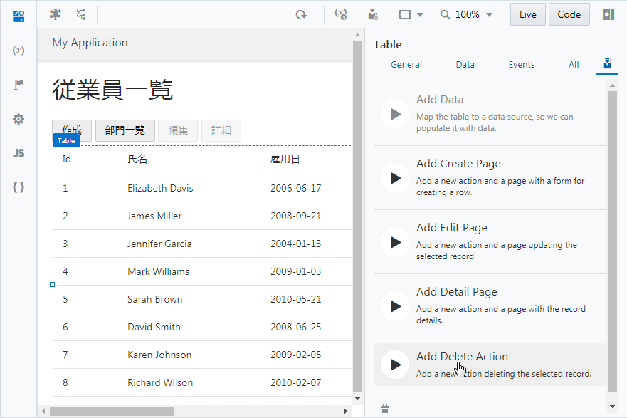
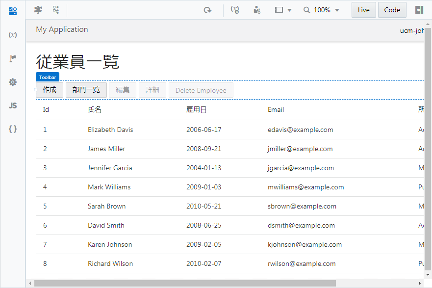

# レコードを削除するボタンの追加

1.  アプリケーション・デザイナで Employees（従業員一覧）ページを開き、『[Employee のレコードの一覧を表示するテーブルの追加](../part3/add_employees_table.md)』で追加した Table コンポーネントを選択します。
    Table コンポーネントのプロパティ・インスペクタで
    
    （Quick Start）アイコンをクリックし、**「Add Delete Action」** をクリックします。

    

1.  **「Add Delete Action」** ダイアログ・ボックスが表示されます。
    **「Select Endpoint」** ページでは、レコードを削除する際にコールする REST エンドポイントを指定します。
    **「Business Objects」** → **「Employee」** を選択します。
    **「Finish」** ボタンをクリックします。

1.  **「Add Delete Action」** ダイアログ・ボックスで **「Finish」** ボタンをクリックすると、Employees ページの Heading コンポーネントと Table コンポーネントの間の Toolbar コンポーネントの中には、**「Delete Employee」** ボタンが配置されています。
    追加された **「Delete Employee」** ボタンは、テーブルでレコードが選択されるまでは無効化されています。

    

----

以上で、Visual Builderのチュートリアルは終了です。コードレスなWebアプリケーションの作成をご体感頂けたでしょうか。
